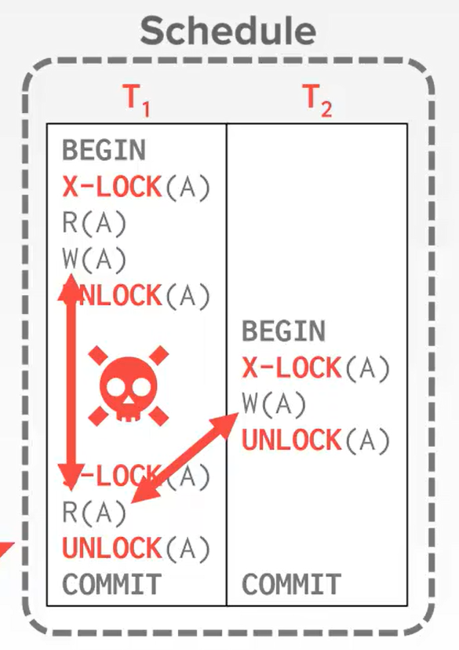
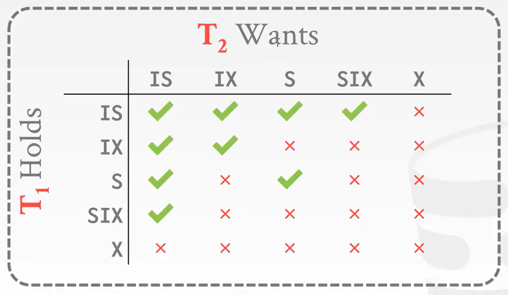
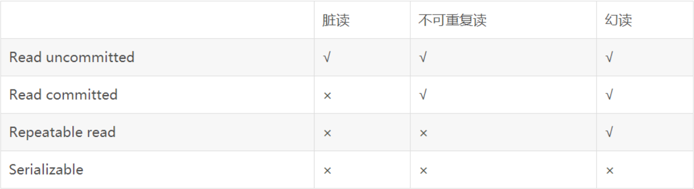

# Concurrency Control

### Strawman System

执行事务时，DBMS会复制整个数据库文件，并将事务更改到此新文件中。如果事务成功，则新文件将成为当前数据库文件。如果事务失败，DBMS将丢弃新文件，并且事务的任何更改都不会被保存。此方法速度较慢，因为它不允许并发事务，并且需要为每个事务复制整个数据库文件。

## ACID

ACID是用于确保数据库正确性的标准

### Atomicity

事务是一个不可分割的工作单位，事务中包括的操作要么全部完成，要么全部不完成。

* 一种实现方法是日志(logging)，记录了改变什么，以防后面回滚
* 另一种是拷贝的备份(Shadow Paging)，名字就已经把做法表达出来了。这种方法效率低但是恢复效果好，但是效率重于一切，现实中很少使用。

### Consistency

事务必须确保数据库的完整性，事务的执行不能破坏数据库的一致性。

我们要保证DB是符合逻辑的(logical)，包括两点，DataBase Consistency and Data Consistency。就是说DB本身要合理，比如岁数非负这种，此外txn也要合理，不能因为执行了某个事务导致其他事务的结果不一致。

### **Isolation**

事务之间彼此隔离，一个事务的执行不能影响其他事务的执行。

这个概念很像操作系统的进程，每个事务都认为自己独占了所有资源，运行的时候没有别人干扰。

悲观(Pessimistic)：DBMS假设事务会发生冲突，所以它一开始就不允许让程序出现问题。

乐观(Optimistic)：DBMS假设事务之间的冲突很少，因此它选择在事务提交后发生冲突时处理冲突。

> 笼统怎么做：
> 
> 1. 不交错不同事务操作的计划。
> 2. 对于任何数据库状态，如果执行第一个计划的效果与执行第二个计划的结果相同，则这两个计划是等效的。
> 3. 不同的串行执行可以产生不同的结果，但都被认为是“正确的”。

> 三种冲突
>
> 1. 读-写冲突（“不可重复读取”）：当多次读取同一对象时，事务无法获得相同的值。
> 2. 写-读冲突（“脏读”）：在事务提交更改之前，事务会看到不同事务的写效果。
> 3. 写-写冲突（“丢失的更新”）：一个事务会覆盖另一个并发事务的未提交数据。

> 序列化 (Serializability)
>
> 1. Conflict Serializability: 当事务遇到冲突时(即多个事务在同一时间访问/修改相同的数据)，必须按照一定顺序串行执行，直到所有冲突都解决。这个顺序或者说优先级的调停，由precedence graph来决定。
> 2. View Serializability: 事务的执行顺序与视图的依赖关系一致，即按照视图的定义来串行执行，注意它也不常用。(Blind Writes: 即写前不读，就直接莽上手)

### Durability

事务一旦提交，它对数据库的修改就永久保存。

又称Persistent，即使在crash之后依旧不丢失数据，就类似File System的持久化。

## 2PL (Two-Phase Locking)

这里先提一下Lock和Latch，Latch在这门课程当中已经见过很多了，总结来说就是用来给线程，或者那种索引节点加锁，而Lock则是给数据库对象或者事务加锁的。

如果我们仅仅加锁，还是无法实现对事务的串行化控制。比如这个例子，即使读写操作都加了锁，保证同一时刻只有一个资源被访问，但T1读取到的信息仍然是有问题的。

Two-Phase Locking (2PL)是一种并发控制协议，它要求事务必须按照固定的顺序执行，并且只能在事务开始和结束时持有资源。

为了实现串行化，2PL协议引入了两个阶段，第一阶段是加锁阶段(Growing)，这个阶段只能加锁，第二阶段是释放锁阶段(Shrinking)，这个节点只能解锁。(图像上来说就是，第一阶段锁的数量是单调递增的，第二阶段锁的数量是单调递减的)

它是一种悲观的并发控制协议，它假设事务之间存在冲突，因此它在事务开始时不给事务任何产生race的可能，直接给你上锁，一棍子打死。

严格的二阶段锁就是全局锁，锁的数量到程序的最后才会一次性全部释放。

### Deadlock and Prevention

严格的二阶段锁很容易触发死锁，预防死锁的办法就是给一个优先级(因为死锁的必要条件之一是相同优先级且不抢占)，优先级由DBMS维护的一个图来保证(不能成环)。

如果死锁还是产生了，就挑一个Victim，让它重来。

两个策略:  
1. Wait-Die("Old Waits for Young): 如果请求事务的优先级高于持有事务，则等待。否则，它将终止（死亡）。
2. Wound-Wait("Young Waits for Old"): 如果请求事务的优先级高于持有事务，则持有事务中止（受伤）并释放锁。否则，请求事务将等待。

### Intention Locks

意向锁，假设有1Billion个锁都需要被锁的时候，我们不可能每个锁都去申请释放。我们可以只锁它的公共父节点，而释放下面的部分锁。但这样做的前提是，公共父节点之下的所有锁，没有被其他的事务所占用/加锁。

但是这样的话，我们每次都需要遍历下面的所有节点去寻找，有没有节点被占用，很耗费时间。所以有意向锁，每一层级只要有一个被锁了，就会在公共父节点那里记录，我们只需要查看这个记录就可以知道是否有下面整层是否存在被锁的节点。

还有这个意向锁，虽然不是真正的锁，但它也分类型，有**IS**(Intent Shared: 表示使用共享锁在较低级别进行显式锁定), **IX**(Intent Exclusive: 表示使用独占或共享锁在较低级别进行显式锁定), **SIX**(Shared Intent Exclusive: 以该节点为根的子树在共享模式下被显式锁定，显式锁定是在较低级别使用独占模式锁完成的)。

## Timestamp Ordering

不同于2PL的悲观锁，它是基于乐观设计的

### Basic T/O

总结来说，朴素实现就是基于时间顺序的操作，你无法操控来自未来的事务，如果冲突了就停止并重试。

> 对于读来说：未来读没问题，但是未来写有问题。因为就算你去读一个在未来会被读的资源，它并不会被改变；而尝试去读一个未来会被改变的数据，那么你此时读到的数据其实是旧的未更新的。
> 
> 对于写来说：未来读和未来写都有问题。因为当前对资源的改变，会影响未来的读写，不能更新未来的数据。

* 优化 (Thomas Write Rule): 如果我们在写后，下一步是未来写，那么无所谓的，就当作我们写了但是被覆盖了，但是如果这之中插入一个未来读，那么就会导致读到的内容出问题。

### OCC (Optimistic Concurrency Control)

这个很类似于Git，它会维护一个本地的stage(每个事务都分配一个private workspace)，它是现在资源的一个拷贝，对资源的任何读写操作都会被作用于stage之上，只有到最后事务要commit了才会将stage进行提交。

在stage将要被commit之前，DBMS会包含其他事务进行综合考量，看看会不会引起冲突，如果不影响则对DB的数据进行直接地修改，搞定后才会commit。

### Isolation Levels

> 总体的逻辑就是要符合Serializable，也就是串行化。所有这些加锁啊什么的操作，都是为了让事务的并发执行，结果看起来跟顺序执行一样。

但是要注意串行化并不是那么好实现的，常见的数据库都无法做到完全串行化，而是低层次的RR, RC

异常情况:  
1. 脏读(Dirty Read): 一个事务读了另一个事务还未提交的变更，如果另一个事务发生了回滚，就会导致事务一读取的结果无效。
2. 不可重复读(Unrepeatable Read): 一个事务先后对进行读，但是在这之间有另一个事务进行写，导致两次重复读取的结果不一致。
3. 幻读(Phantom Read): 一个事务进行全表操作，完成之后另一个事务进行了插入操作，导致事务一全表扫描发现多出了一个Tuple。

* Read Uncommitted (RU): 允许脏读，也就是可能读到其他事务未提交的变更。放开索引锁，并且删除Shared锁(读锁)。
* Read Committed (RC): 禁止脏读，只能读到已经提交的事务，也就是只能读到其他事务提交的最新数据。放开索引锁，并且Shared锁(读锁)会立即解锁。
* Repeatable Read (RR): 幻读有可能发生，保证同一事务的多个实例在并发环境中返回同样的结果，禁止脏读和不可重复读，也就是在同一事务中，同样的查询语句返回的结果必须是一致的。放开索引锁。
* Serializable (S): 最严格的隔离级别，确保事务之间的数据完全一致，避免脏读、不可重复读、幻读。需要加所有锁，并执行严格2PL。
 

## MVCC (Multi-Version Concurrency Control)

这个更像Git，它维护一个历史版本的快照，**每次写操作进行修改都会进行一个版本的保存，生成一个新的快照**，而读操作都会根据时间戳(Timestamp)读到对应的快照。

我们可以发现`MVCC`甚至无法避免脏读，所以一般来说，它都得结合我们之前讲的2PL, TO, OCC一起进行并发控制。

