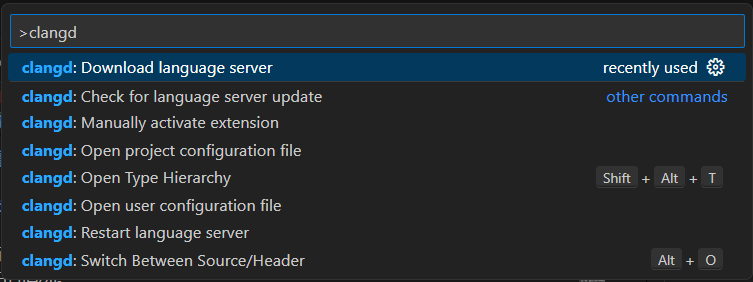
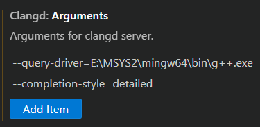
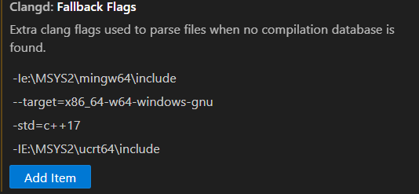
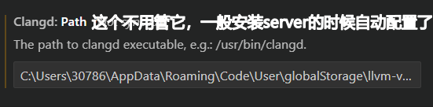

# 从微软C/C++插件 到 Clangd --起飞的体验指南

我指的是就是微软的C/C++插件，标题是因为不能带`+`号。

大家应该用vscode的基本看网上的配置教程，下载完第一步，就是安装C/C++插件。

前几天因为在wsl2里面迟迟不出现代码提示，我直接就完全卸载了微软C/C++插件，然后开始了Clangd的尝试。

事实证明，一旦见过了真理，就再也无法在谎言中苟活。

~~我去你的微软~~

~~Fuck Microsoft~~

## C/C++插件的七宗罪

1. 编译速度慢

    真的慢，或者直接不显示了。

2. 代码提示不准确

    代码提示慢慢慢慢，或者提示错误的地方。intellisense真是个大坑。

3. 代码跳转不准确

    跳转不准确，或者跳转到错误的地方。

4. 占用空间大

   我真是服了，占了我5个G的空间，还硬往C盘钻。错过了固态降价时代，让我本就不富裕的512G内存雪上加霜。有人说这个位置和上限大小都可以设置了，我的评价是被pua惯了。

## clangd的优点

1. 编译速度快

    编译速度快，而且提示功能强大。

2. 代码跳转准确

    跳转准确，而且可以跳转到函数定义处。

3. 占用空间小

    占用空间小，只需要安装clangd，就能使用，不需要安装微软C/C++插件。

4. 跨平台

    跨平台，可以用在windows、linux、macos上。

5. 扩展性强

    扩展性强，可以自定义配置，比如提示的颜色、提示的优先级、提示的阈值等。

6. 社区活跃

    社区活跃，有很多优秀的插件，可以参考学习。

## 配置

### Linux端

这个简单了，我就只说我实践过的，vscode运行wsl2，本来已经正常运行C/C++插件的情况。

1. 卸载C/C++相关的插件。~~真给我滚远点，那些教人用这个的也都是误人子弟~~

2. 安装clangd插件

3. 按照提示安装clangd server。我是右下角就直接跳出来`install`的提示栏了，如果你没有可以这样。
   
    1. `ctrl + shift + p` 打开命令面板
    2. 输入`clangd` 选择`Clangd: Download language server`
    
    3. 等待下载完成，安装完成。

4. enjoy 立马就能用了，你可以体验到类似clion的提示功能

### Windows端

这个就不太一样了，我实践过的步骤如下：

1. 同Linux端的前三步

2. 这时候发现出问题了，头文件报错，显示经典的`include path not found`， 我找了挺多文章，问了gpt4o，都没有解决。因为我试了一些，cmake或者g++都是可以正确编译的，但就是自动补全，或者说clangd的找不到头文件。

3. 自己找解决方案: 大概就去设置里面配置一下Clangd的设置。打开vscode的设置`ctrl + ,`，搜索`Clangd`，找到这两个东西，然后找到你自己的路径添加配置。

    

    

    

4. 最后，你就可以愉快的使用clangd了。~~反正我是真能用了~~