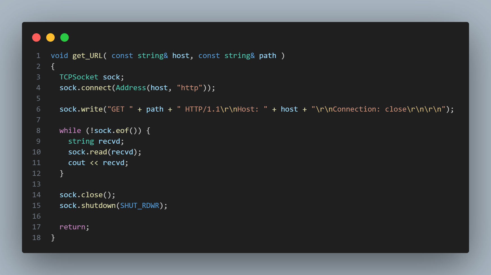
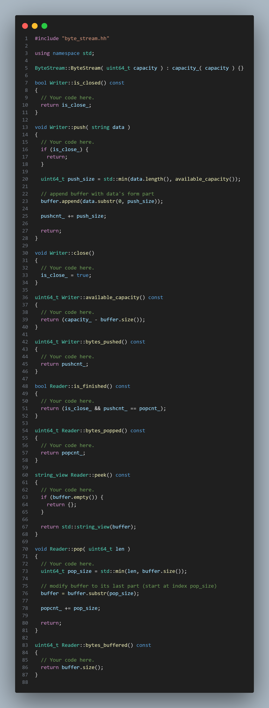

# Stanford CS144  lab 0

[视频讲解](https://www.bilibili.com/video/BV1pM4m197ma/?spm_id_from=333.999.0.0&vd_source=f53099189814dd887f4ab25638e07406)

### webget

* 我的解法
```cpp
void get_URL( const string& host, const string& path )
{
  TCPSocket sock;
  sock.connect(Address(host, "http"));

  sock.write("GET " + path + " HTTP/1.1\r\nHost: " + host + "\r\nConnection: close\r\n\r\n");

  while (!sock.eof()) {
    string recvd;
    sock.read(recvd);
    cout << recvd;
  }

  sock.close();
  sock.shutdown(SHUT_RDWR);

  return;
}
```

(或者说可能这个长得好看点)


* 运行结果

```sh
╰─❯ cd minnow/build/

…3  root@LAPTOP-2CKOL1GC  15:38:26 
╰─❯ make && make check_webget
[ 35%] Built target util_debug
[ 64%] Built target minnow_debug
[ 71%] Built target minnow_testing_debug
[ 78%] Built target stream_copy
[ 92%] Built target webget
[100%] Built target tcp_native
Test project /root/minnow/build
    Start 1: compile with bug-checkers
1/2 Test #1: compile with bug-checkers ........   Passed    3.69 sec
    Start 2: t_webget
2/2 Test #2: t_webget .........................   Passed    2.32 sec

100% tests passed, 0 tests failed out of 2

Total Test time (real) =   6.01 sec
Built target check_webget
```

### byte stream

* 我的解法

```cpp
// byte_stream.hh

protected:
  // Please add any additional state to the ByteStream here, and not to the Writer and Reader interfaces.
  uint64_t capacity_;
  bool error_ {};
  std::string buffer {};
  bool is_close_ {};
  uint64_t pushcnt_ {};
  uint64_t popcnt_ {};
```

```cpp
// byte_stream.cc

#include "byte_stream.hh"

using namespace std;

ByteStream::ByteStream( uint64_t capacity ) : capacity_( capacity ) {}

bool Writer::is_closed() const
{
  // Your code here.
  return is_close_;
}

void Writer::push( string data )
{
  // Your code here.
  if (is_close_) {
    return;
  }

  uint64_t push_size = std::min(data.length(), available_capacity());
  
  // append buffer with data's form part
  buffer.append(data.substr(0, push_size));

  pushcnt_ += push_size;

  return;
}

void Writer::close()
{
  // Your code here.
  is_close_ = true;
}

uint64_t Writer::available_capacity() const
{
  // Your code here.
  return (capacity_ - buffer.size());
}

uint64_t Writer::bytes_pushed() const
{
  // Your code here.
  return pushcnt_;
}

bool Reader::is_finished() const
{
  // Your code here.
  return (is_close_ && pushcnt_ == popcnt_);
}

uint64_t Reader::bytes_popped() const
{
  // Your code here.
  return popcnt_;
}

string_view Reader::peek() const
{
  // Your code here.
  if (buffer.empty()) {
    return {};
  }

  return std::string_view(buffer);
}

void Reader::pop( uint64_t len )
{
  // Your code here.
  uint64_t pop_size = std::min(len, buffer.size());

  // modify buffer to its last part (start at index pop_size)
  buffer = buffer.substr(pop_size);

  popcnt_ += pop_size;

  return;
}

uint64_t Reader::bytes_buffered() const
{
  // Your code here.
  return buffer.size();
}
```



* 运行结果

```sh
╰─❯ make && make check0
[ 35%] Built target util_debug
[ 64%] Built target minnow_debug
[ 71%] Built target minnow_testing_debug
[ 78%] Built target stream_copy
[ 92%] Built target webget
[100%] Built target tcp_native
Test project /root/minnow/build
      Start  1: compile with bug-checkers
 1/10 Test  #1: compile with bug-checkers ........   Passed    0.23 sec
      Start  2: t_webget
 2/10 Test  #2: t_webget .........................   Passed    1.09 sec
      Start  3: byte_stream_basics
 3/10 Test  #3: byte_stream_basics ...............   Passed    0.01 sec
      Start  4: byte_stream_capacity
 4/10 Test  #4: byte_stream_capacity .............   Passed    0.01 sec
      Start  5: byte_stream_one_write
 5/10 Test  #5: byte_stream_one_write ............   Passed    0.01 sec
      Start  6: byte_stream_two_writes
 6/10 Test  #6: byte_stream_two_writes ...........   Passed    0.01 sec
      Start  7: byte_stream_many_writes
 7/10 Test  #7: byte_stream_many_writes ..........   Passed    0.04 sec
      Start  8: byte_stream_stress_test
 8/10 Test  #8: byte_stream_stress_test ..........   Passed    0.02 sec
      Start 37: compile with optimization
 9/10 Test #37: compile with optimization ........   Passed    0.09 sec
      Start 38: byte_stream_speed_test
             ByteStream throughput: 1.35 Gbit/s
10/10 Test #38: byte_stream_speed_test ...........   Passed    0.13 sec

100% tests passed, 0 tests failed out of 10

Total Test time (real) =   1.64 sec
Built target check0
```