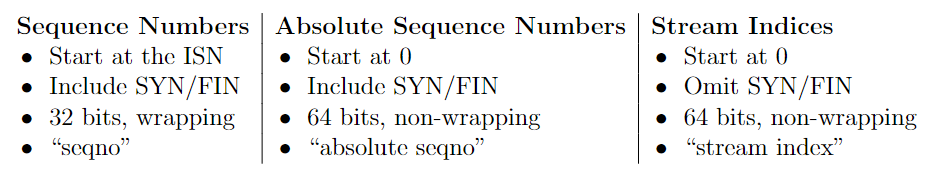
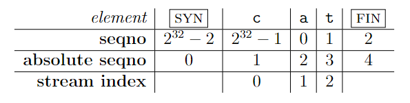

# Stanford CS144 lab 2

这个lab分为两个部分——wrap和unwrap，TCP receiver的实现  
回顾lab0和lab1，它们其实都是一个造积木的过程，而到了lab2当中，当然wrap和unwrap也还是在造积木。但到了TCPreceiver则开始搭积木了，它将之前我们所创建的几个小Class，通过调用其中的几个API给组合在了一起

### wrap和unwrap的实现

* 解释

先来讲讲这两个函数的实现，而在这之前先让我们了解一下这三个概念

我先来自己解释一波:  

1. seqno(Sequence Numbers): 类型为Wrap32，实际里面的组成其实就是32位的一个数(如下)，能从32位的任何数(ISN)开始
    ```cpp
    struct Wrap32 {
        uint32_t raw_number {};
    }
    ```
2. abs seqno(Absolute Sequence Numbers): 类型是uint64_t，这个就是一个64位的数，始于0
3. stream index(Stream indices): 类型是uint64_t，其实就是我们之前reassembler里面的那个index

(这个是CS144官方文档当中的解释)


* 转换

**也就是说我们要把64位的一个数映射到32位数当中**

这个wrap让我们实现的其实就是这样一个转换: seqno → seqno  
而unwrap就是这样的: seqno → absolute seqno

> **最核心的一点**: `(zero_point + absolute_seqno) % (1 << 32) = seqno`

自然而然想出的办法就是**取模**运算

(这个图是官方文档给出的这三者之间的相互转换关系)


* 实现

我这里采用的是位运算式的取模运算  
wrap比较简单，而unwrap除了直接取模，还存在着两个fringe case...

```cpp
Wrap32 Wrap32::wrap( uint64_t n, Wrap32 zero_point )
{
	uint32_t raw = (static_cast<uint32_t>(n) + zero_point.raw_value_) % (1UL << 32);
	return Wrap32 { raw };
}
```

```cpp
uint64_t Wrap32::unwrap( Wrap32 zero_point, uint64_t checkpoint ) const
{
	uint64_t prefix = checkpoint & 0xFFFF'FFFF'0000'0000;
	uint64_t raw;
	if (this->raw_value_ >= zero_point.raw_value_) {
		raw = (static_cast<uint64_t>(this->raw_value_) - static_cast<uint64_t>(zero_point.raw_value_));
	} else {
		raw = (static_cast<uint64_t>(this->raw_value_) + (1UL << 32) - static_cast<uint64_t>(zero_point.raw_value_));
	}
	uint64_t probable_res2 = prefix + raw;
	uint64_t probable_res1 = probable_res2 > (1UL << 32) ? probable_res2 - (1UL << 32) : probable_res2;
	uint64_t probable_res3 = probable_res2 < (0xFFFF'FFFF'FFFF'FFFF) - (1UL << 32) ? probable_res2 + (1UL << 32) : probable_res2;

	if (checkpoint - probable_res1 < (1UL << 31)) {
		return probable_res1;
	} else if (probable_res3 - checkpoint < (1UL << 31)) {
		return probable_res3;
	} else {
		return probable_res2;
	}
}
```

### TCP receiver

将我们前面所实现的三块积木——byte stream, reassembler, (un)wrap，给搭建在一起的过程  
(很多老哥说这个lab的前半部分难，但个人做到receiver的时候感觉更懵逼一点，就是你不知道它要干嘛)  
奇奇怪怪的，直接上代码

```cpp
#include "tcp_receiver.hh"

using namespace std;

void TCPReceiver::receive( TCPSenderMessage message )
{
	if (writer().has_error()) {
		return;
	}
	if (message.RST) {
		reader().set_error();
		return;
	}
	// the parameters should be translated from seqno to absolute seqno
	if (!isn_.has_value()) {
		if (!message.SYN) {
			return;
		}
		isn_.emplace(message.seqno);
	}
	Wrap32 zero_point = isn_.value();
	uint64_t checkpoint = writer().bytes_pushed() + static_cast<uint32_t>(message.SYN);
	uint64_t abs_seqno = message.seqno.unwrap(zero_point, checkpoint);
	uint64_t stream_index = abs_seqno + static_cast<uint64_t>(message.SYN) - 1;
	reassembler_.insert(stream_index, move(message.payload), message.FIN);
}

TCPReceiverMessage TCPReceiver::send() const
{
	uint16_t wdsz = static_cast<uint16_t>(min(writer().available_capacity(), static_cast<uint64_t>(UINT16_MAX)));
	bool reset = writer().has_error();
	if (isn_.has_value()) {
		Wrap32 ackno = Wrap32::wrap(writer().bytes_pushed() + static_cast<uint64_t>(writer().is_closed()), isn_.value()) + 1;
		return { ackno, wdsz, reset };
	} else {
		return { nullopt, wdsz, reset };
	}
}
```

* 测试结果:  

```sh
╰─❯ make && make check2
[ 35%] Built target util_debug
[ 35%] Building CXX object src/CMakeFiles/minnow_debug.dir/tcp_receiver.cc.o
[ 42%] Linking CXX static library libminnow_debug.a
[ 64%] Built target minnow_debug
[ 71%] Built target minnow_testing_debug
[ 78%] Built target stream_copy
[ 85%] Linking CXX executable webget
[ 92%] Built target webget
[ 92%] Linking CXX executable tcp_native
[100%] Built target tcp_native
Test project /root/minnow/build
      Start  1: compile with bug-checkers
 1/29 Test  #1: compile with bug-checkers ........   Passed    1.82 sec
      Start  3: byte_stream_basics
 2/29 Test  #3: byte_stream_basics ...............   Passed    0.02 sec
      Start  4: byte_stream_capacity
 3/29 Test  #4: byte_stream_capacity .............   Passed    0.01 sec
      Start  5: byte_stream_one_write
 4/29 Test  #5: byte_stream_one_write ............   Passed    0.01 sec
      Start  6: byte_stream_two_writes
 5/29 Test  #6: byte_stream_two_writes ...........   Passed    0.01 sec
      Start  7: byte_stream_many_writes
 6/29 Test  #7: byte_stream_many_writes ..........   Passed    0.04 sec
      Start  8: byte_stream_stress_test
 7/29 Test  #8: byte_stream_stress_test ..........   Passed    0.02 sec
      Start  9: reassembler_single
 8/29 Test  #9: reassembler_single ...............   Passed    0.01 sec
      Start 10: reassembler_cap
 9/29 Test #10: reassembler_cap ..................   Passed    0.01 sec
      Start 11: reassembler_seq
10/29 Test #11: reassembler_seq ..................   Passed    0.01 sec
      Start 12: reassembler_dup
11/29 Test #12: reassembler_dup ..................   Passed    0.03 sec
      Start 13: reassembler_holes
12/29 Test #13: reassembler_holes ................   Passed    0.01 sec
      Start 14: reassembler_overlapping
13/29 Test #14: reassembler_overlapping ..........   Passed    0.01 sec
      Start 15: reassembler_win
14/29 Test #15: reassembler_win ..................   Passed    0.20 sec
      Start 16: wrapping_integers_cmp
15/29 Test #16: wrapping_integers_cmp ............   Passed    0.01 sec
      Start 17: wrapping_integers_wrap
16/29 Test #17: wrapping_integers_wrap ...........   Passed    0.01 sec
      Start 18: wrapping_integers_unwrap
17/29 Test #18: wrapping_integers_unwrap .........   Passed    0.01 sec
      Start 19: wrapping_integers_roundtrip
18/29 Test #19: wrapping_integers_roundtrip ......   Passed    0.99 sec
      Start 20: wrapping_integers_extra
19/29 Test #20: wrapping_integers_extra ..........   Passed    0.21 sec
      Start 21: recv_connect
20/29 Test #21: recv_connect .....................   Passed    0.01 sec
      Start 22: recv_transmit
21/29 Test #22: recv_transmit ....................   Passed    0.23 sec
      Start 23: recv_window
22/29 Test #23: recv_window ......................   Passed    0.01 sec
      Start 24: recv_reorder
23/29 Test #24: recv_reorder .....................   Passed    0.01 sec
      Start 25: recv_reorder_more
24/29 Test #25: recv_reorder_more ................   Passed    0.66 sec
      Start 26: recv_close
25/29 Test #26: recv_close .......................   Passed    0.01 sec
      Start 27: recv_special
26/29 Test #27: recv_special .....................   Passed    0.02 sec
      Start 37: compile with optimization
27/29 Test #37: compile with optimization ........   Passed    0.74 sec
      Start 38: byte_stream_speed_test
             ByteStream throughput: 1.38 Gbit/s
28/29 Test #38: byte_stream_speed_test ...........   Passed    0.13 sec
      Start 39: reassembler_speed_test
             Reassembler throughput: 10.41 Gbit/s
29/29 Test #39: reassembler_speed_test ...........   Passed    0.15 sec

100% tests passed, 0 tests failed out of 29

Total Test time (real) =   5.39 sec
Built target check2
```