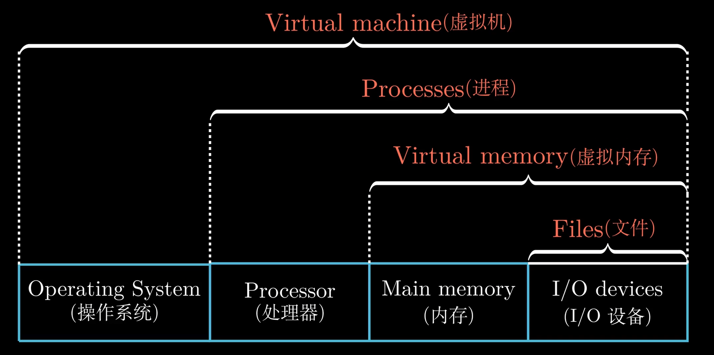
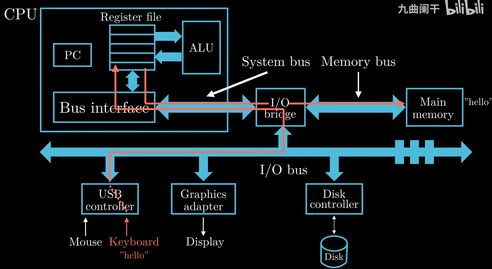
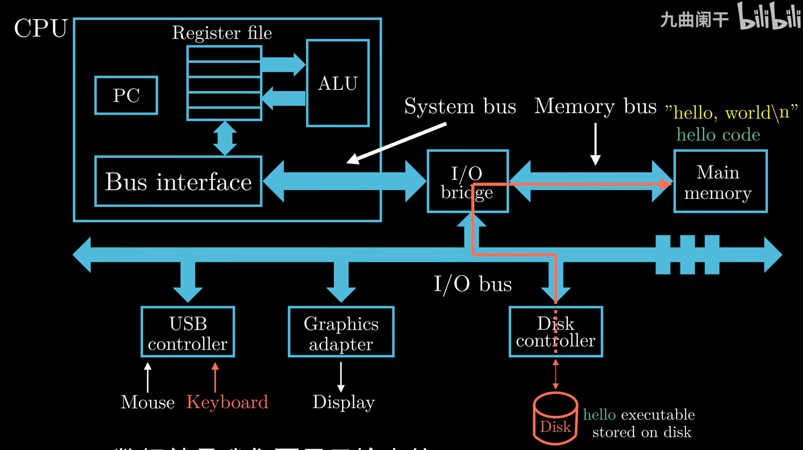
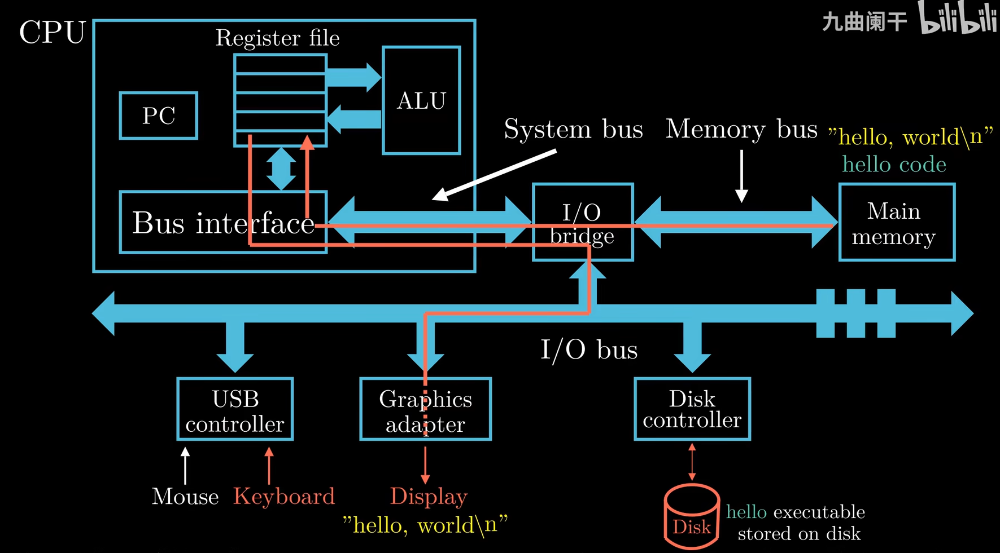
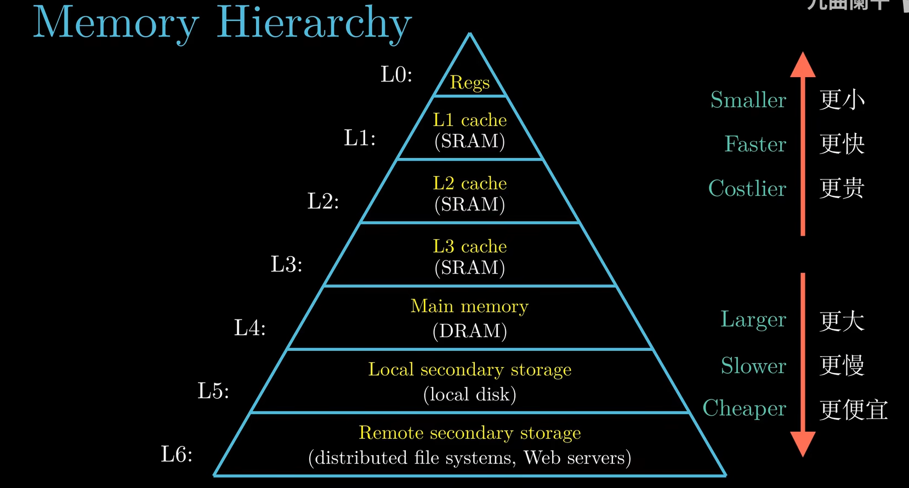
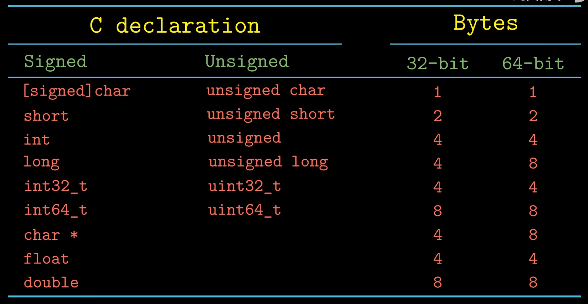
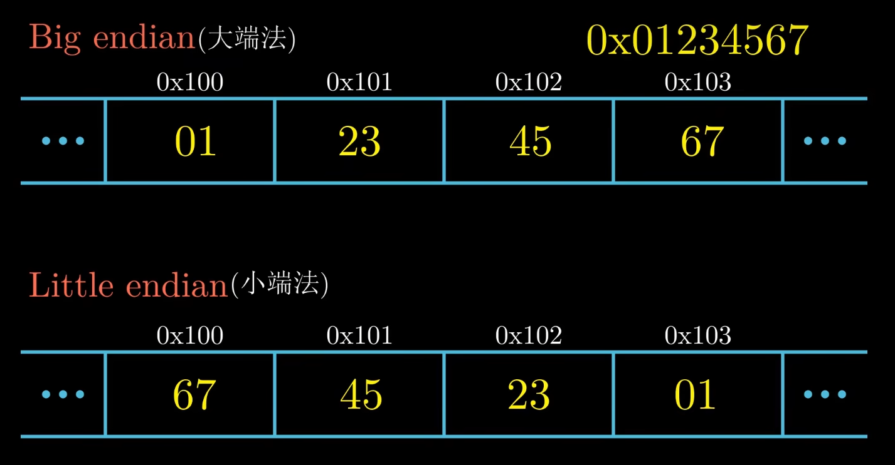
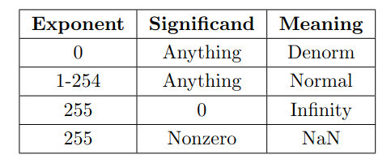

# Computer Science: A Programmer's Perspective

> 这个是很久之前的关于csapp中计算机当中数的表示的笔记，图一乐即可

## 1. A Tour of Computer Systems

***Abstractions in Computer Systems***

### Hardware Organization of a System
1. two continuous call may not adjacent
2. ***word***: per word, 32bit-machine -> 4Byte, 64bit-machine -> 8Byte
3. ***Program Counter***
4. ***Register File(寄存器)***
5. ***Algorithm/Logical Unit***
6. ***Main Memory(主存)***
7. ***Bus(总线)***
8. ***I/O devices***

input by keyboard

execution

output through graphic
{:height="50%" width="50%"}
9. **large -> slow and cheap, small -> fast and cost  
上级层级是下级层级的高速缓存**
{:height="50%" width="50%"}

---

### How to dramatically improve computer performance

***Amdahl's law*** `s = 1 / ((1 - a) + a / k)`  
which indicate we need to work a lot if we want to improve computer's performance.

1. ***Multi-core Processor(多核)***
: every CPU core has its L1 cache and L2 cache, all the cores share L3 cache.

2. ***Hyperthreading(超线程)***
: Instruction-Level Parallelism(流水线作业)
  Single Instruction Multiple Data

---

## 2. Representing and Manipulating Information

### Information Storage
1. ***Hexadecimal***: start with `0x`
2. ***Decimal***
3. ***Binary***
4. ***the storage of different types***

5. ***Addressing and Byte Ordering***: mostly machines use `Litlle Endian`

### Integer Representations

#### Representation of negatives 

1. Reverse Encoding(反码)
: **1' s complement**: flip every single bit 
: 负数是正数二进制按位取反的结果 
  shortcoming: error in representation of 0

2. Complement Encoding(补码) 
: **2' s complement**: flip every single bit and plus 1
: 最高位权重取负,其余与非负数表示相同。(最高位为1并不仅仅是取负号) 
如`1011 = -1*2^3 + 0*2^2 + 1*2^1 + 1*2^0`

3. Bias complement(偏码)
: 比较大小时类似unsigned,同位时直接比较大小,实际值为表达式值加上bias值 `bias = -(2 ^ (n-1) - 1)`

### Integer Arithmetic

***if Overflow***

1. unsigned number: if `x + y > 2^w`, `x + y = x + y - 2^w`
2. number: 
    1. **positive** &nbsp; if `x + y > 2^w`, `x + y = x + y - 2^(w+1)` 
    2. **negative** &nbsp; if `x + y < 2^w`, `x + y = x + y + 2^(w+1)` 

### Floating Point

> * For normalized floats:  
    Value = (−1)^Sign ∗ 2^(Exp+Bias) ∗ 1.significand(2)  
> * For denormalized(exponent all 0 and significand not all 0) floats:  
>     Value = (−1)^Sign ∗ 2^(Exp+Bias+1) ∗ 0.significand(2)  
> *  Why exp need to be always 0? Cuz denorm is used to represent the numbers around 0.  

1. float (32bit = 4Byte) 
   1. sign 符号位 1bit (31): (-1)^n. 0 -> p, 1 -> n.
   2. exponent 指数位 8bit (30 - 23): 
    > unsigned[0, 255] - bias(`(2 ^ (n-1) - 1)` = 127)  
    ***scope: [-126, 127]*** (why not [-127, 128], 0000_0000, 1111_1111 represent infinite or NaN)  
    e.g. 1000_0001: (2^8 + 2^0) - 127
   3. significand 小数位 23bit (22 - 0):
      > for normal float: 1 is implicit, so there is 24 bit actually  
     store as big endian: e.g. `0100_0000...0000 = 2 ^ (-2)`
      
2. double (64bit = 8Byte)  
    1. sign 1bit (63)
   2. exponent 11bit (62 - 52)
   3. significand 53bit (52 - 0)

3. representation   

    1. +0: sign = 0, e = s = 0000_0000
   2. -0: sign = 1, e = s = 0000_0000
   3. +infinity: sign = 0, e = 1111_1111, s = 0000_0000
   4. -infinity: sign = 1, e = 1111_1111, s = 0000_0000
   5. NaN(Not a Number): sign = 0/1, e = 1111_1111, s != 0

4. transform
  > e.g.  (10.75)10 to float
  > 1. represent as binary: `1010.11`
  > 2. Write binary numbers as 1.xxxx forms of scientific records: `1.01011*10^3`
  > 3. exponent + bias: `3+127 = 130` so the exponent bit is `1000_0010`
  > 4. significand: `0101_1000_0000_0000_0000_000`
  > 5. signal bit: `0`, for 10.75 is positive
  > 6. get result: `10.75 = 0|1000_0010|0101_1000_0000_0000_0000_000`