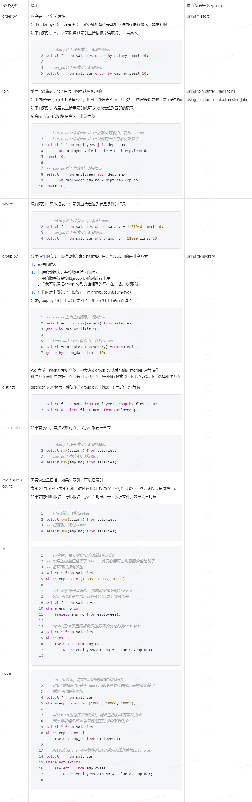

# 数据库查询优化

先来看看这段SQL语句：

```sql
SELECT
  * 
FROM
  departments
  JOIN dept_emp ON departments.dept_no = dept_emp.dept_no 
WHERE
  departments.dept_name = 'Marketing' 
  LIMIT 10;
```

它是包含了 `JOIN`, `WHERE` 和 `LIMIT` 三个关键字的基本查询语句。

## 执行策略

我将用伪代码来描述数据库查询优化的执行策略：

1. **朴素查询**

    ```python
    departments_data = load_from_database('departments')
    dept_emp_data = load_from_database('dept_emp')

    # 计算 JOIN 结果
    join_result = []
    for d1 in departments_data:
        for d2 in dept_emp_data:
            if d1['dept_no'] == d2['dept_no']:
                join_result.append(d1)

    # 过滤 WHERE 条件
    where_result = []
    for d in join_result:
        if d['dept_name'] == 'Marketing':
            where_result.append(d)

    # 排序 LIMIT 结果
    result = where_result[:10]
    return result
    # 如果还有排序: result = sorted(result, key=lambda x: x['dept_no'])[:10]
    ```

    这一眼太老实了，虽然它是电脑不累，你也不能这么老实啊。比如单表有100万条数据，那么这就需要计算一万亿次的数量级，时间复杂是 O(n^2)。

2. **增量查询策略**

    ```python
    result = []
    departments_cursor = open_cursor('departments') # 获取departments的游标
    while not departments_cursor.eof():
        d = departments_cursor.read() # 在不空的情况下，读取departments的一行数据
        if d['dept_name'] == 'Marketing':
            # 若满足条件，则读取dept_emp表
            dept_emp_cursor = open_cursor('dept_emp')
            while not dept_emp_cursor.eof():
                de = dept_emp_cursor.read()
                # 做 JOIN 操作
                if de['dept_no'] == d['dept_no']:
                    result.append(d)
                    # 若记录数达到10，则退出循环
                    if len(result) == 10:
                        break
    return result
    ```

    这个是我们在 CMU-15445 学到的优化策略，它是基于增量查询的。类似一种top-K问题，每次都是一条一条读取数据，直到满足条件就不再读取了。这样可以大大减少查询的时间。

    但问题是，如果我们需要的数据在100万条的最后10条中，那其实复杂度是提升不大的。

3. **索引优化策略**

    ```python
    # 利用索引获取 departments 表中 dept_name='Marketing' 的记录
    departments_index_cursor = search_index('departments', 'dept_name', 'Marketing')
    while not departments_index_cursor.eof():
        d = departments_index_cursor.read()
        # 利用索引获取 dept_emp 表中 dept_no=d['dept_no'] 的记录
        dept_emp_index_cursor = search_index('dept_emp', 'dept_no', d['dept_no'])
        while not dept_emp_index_cursor.eof():
            de = dept_emp_index_cursor.read()
            # 至此，我们已经成功完成了 WHERE 和 JOIN 操作
            result.append(d)
            # 若记录数达到10，则退出循环
            if len(result) == 10:
                break
    return result
    ```

## 特性总结

1. **增量查询**:  
  只要收集到了足够的结果，就立刻返回，避免全量计算，减少工作量
2. **索引加速**:  
  在数据存储时做预先的排序，在查询时利用有序性快速定位到所需的行，最大发挥增量查询的优势


