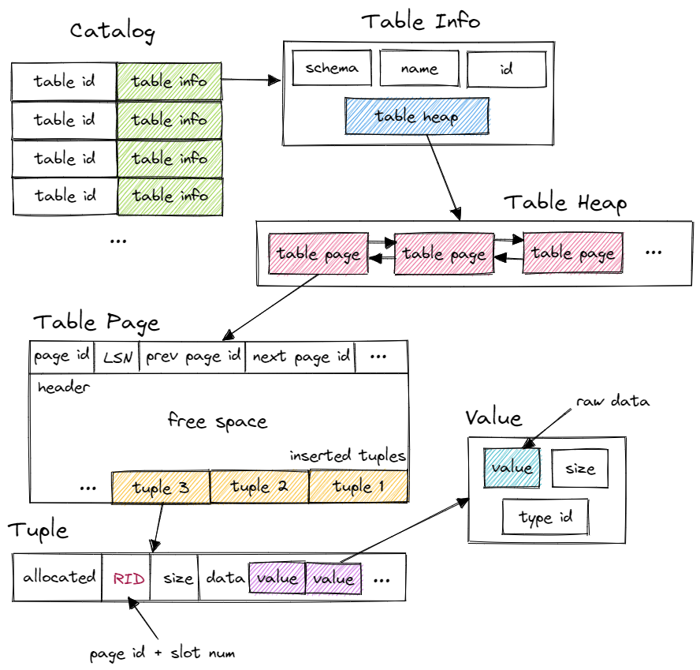

# 数据库面试题



## 执行一条 SQL 语句的过程

1. 解析器（Parser）：

* 功能：解析器负责将 SQL 语句解析成抽象语法树（Abstract Syntax Tree, AST）。

* 步骤：

  1. 语法分析：检查 SQL 语句是否符合 SQL 语法规则。

  2. 语义分析：验证 SQL 语句中引用的表、列是否存在，以及用户是否有权限访问这些对象。

2. 优化器（Optimizer）：

* 功能：优化器负责对解析后的 AST 进行优化，生成一个高效的执行计划。

* 优化策略：

   1. 选择索引：选择最优的索引（如 B+Tree 索引）来加速查询。例如，对于查询条件涉及多个字段的情况，优化器会选择最合适的索引来减少扫描的数据量。

   2. 表连接顺序：确定多表连接的最佳顺序，以减少 I/O 操作和排序的开销。

   3. 查询重写：对查询进行逻辑优化。例如，将子查询转换为连接操作，或者将复杂的条件表达式简化为更高效的形式。

   4. 代价估算：基于统计信息（如表的大小、索引的选择性等），估算不同执行计划的代价，并选择代价最小的计划。

3. 代码生成器（Code Generator）：

* 功能：将优化后的 AST 转换为可执行的目标代码。

* 示例：将 SELECT * 中的 * 替换为具体的列名，或者将逻辑操作转换为物理操作（如扫描表、使用索引等）。

4. 执行器（Executor）：

* 功能：执行器负责执行生成的执行计划，并返回查询结果。

* 执行模型：

  1. 火山模型（Volcano/Iterative Model）：将关系代数中的每个操作抽象为一个 Operator，整个查询被构建成一个 Operator 树。查询树自顶向下调用 next() 接口，数据自底向上被拉取处理。

  * 优点：内存占用低，适合处理大规模数据。

  * 缺点：对于 JOIN、ORDER BY 等操作，可能需要阻塞等待数据完全加载（init() 阶段）。

  2. 物化模型（Materialized Model）：每个 Operator 一次性处理所有输入数据，并将所有输出返回给上层。

  * 优点：适合小规模数据，执行效率高。

  * 缺点：内存占用高，不适合处理大规模数据。

  3. 向量化模型（Vectorized/Batch Model）：折衷方案，将查询过程分解为多个批次，每个批次处理一部分数据，然后合并结果。

  * 优点：兼顾内存占用和执行效率，适合中等规模数据。

## OLTP 和 OLAP 的区别

* **OLTP（Online Transaction Processing）**：事务处理型数据库，主要用于处理实时事务，如银行交易、零售订单等。适合处理事务，也就是适合用户使用。

* **OLAP（Online Analytical Processing）**：分析型数据库，主要用于处理历史数据，如财务报表、销售数据等。适合公司统计或数据分析使用。

## Database 和 DBMS 的区别

数据库（Database）：存储数据的集合。

DBMS（Database Management System）：数据库管理系统，是管理数据库的软件。它包括数据库的建立、维护、使用、保护、备份等功能。

## 数据库的 ACID 特性

ACID（Atomicity、Consistency、Isolation、Durability）：原子性、一致性、隔离性、持久性。

* 原子性（Atomicity）：一个事务是一个不可分割的工作单位，事务中包括的诸操作要么全部完成，要么全部不完成，不会只执行一部分操作。

* 一致性（Consistency）：数据库的一致性指的是事务的执行前后，数据库的完整性没有被破坏。

* 隔离性（Isolation）：隔离性是指多个事务并发执行时，一个事务的执行不能被其他事务干扰。

* 持久性（Durability）：持久性是指一个事务一旦提交，它对数据库中数据的改变就应该是永久性的。

## 索引

### 索引的目的

通过索引，数据库管理系统可以快速找到数据。

### 如何判断索引的最优解

能排除更多的数据的索引就是好索引。

### 索引的分类

   1. 聚集索引：索引和数据保存在一起，索引的顺序就是数据的排列顺序。叶子直接保存值本身。
   2. 非聚集索引：索引和数据分开存储，索引的顺序和数据无关。叶子上保存的是值所在的地址。

### 数据结构选择

1. B-Tree：B-Tree 是一种平衡的多叉树，它可以快速查找数据。时间复杂度为 O(log n)。
2. Hash：Hash 表是一种以键-值对存储数据的结构。在哈希冲突时，时间复杂度不稳定。时间复杂度为 O(1)，但遇到哈希冲突时，性能会下降。
3. B+Tree：B+Tree 是一种多路平衡查找树，它可以快速查找数据，并且可以进行范围查询。与 B-Tree 相比最大不同在于，B+Tree 只在叶子节点保存数据。时间复杂度为 O(log n)。

### change buffer

change buffer 是 MySQL 为了提高性能而引入的一种机制。它在位置上处于 buffer pool 中，主要用于缓存数据的修改操作。

当数据进行写入的时候，首先会先写入 change buffer。然后等哪天磁盘里的索引正好被读入 buffer pool 的时候，MySQL 才会将 change buffer 中的数据写入磁盘。

## 查询

### Mybatis Plus 分表

将一个表的记录分割到数个表中，可以减少索引的大小，加快索引的查询速度。

当查询到的记录太多时，可以将数据分成多个表，然后通过 Mybatis Plus 的分表插件来查询。具体操作如下：

1. 创建分表规则：在数据库中创建分表规则，比如按年、月、日来分表。
2. 配置 Mybatis Plus 分表插件：在 Mybatis Plus 的配置文件中配置分表插件。
3. 使用分表查询：在 Mapper 接口中使用分表查询。

### 联合查询(JOIN)

```sql
SELECT a.id, b.name FROM table_a as a JOIN table_b as b ON a.id = b.id;
```

1. **inner join**：只返回两个表中都存在的数据。
2. **left join**：返回左边表中所有数据，右边表中存在的数据用 null 填充。
3. **right join**：返回右边表中所有数据，左边表中存在的数据用 null 填充。

### 连接查询(UNION)

将两个或多个 SELECT 语句的结果组合在一起，并去除重复的行。查询同一个表的相同列。

## 主键

* 聚簇索引：也可以理解为主键索引，它也是索引的一种，一般会基于 B+Tree 或者 Hash 实现。而它的特点比较明显，一般叶子节点中直接存储了数据的引用，也可以理解为存储了数据本身，可以直接获取数据。又因为它是基于主键的，而主键又是唯一的，因此一张表中只能有一个聚簇索引。
* 非聚簇索引：又称二级索引，顾名思义它想要获取数据是非直接的。在叶子节点中，它只存储目标数据的主键 ID，要获取数据，必须得回表查询，通过主键 ID 再次查询到数据。（回表查询指的是当数据库引擎无法直接从索引中获取所需数据，而需要回到原始数据表中进行额外的查找操作）

## 隔离级别

MySQL 默认的隔离级别是可重复读（REPEATABLE READ）。

表中从上到下，隔离等级依次上升，隔离性越强，并发性越低，也就是效率越低。

| 隔离级别 | 脏读(Dirty Read) | 不可重复读(Non-Repeatable Read) | 幻读(Phantom Read) |
| -------- | ---------------- | ---------- | ------------------ |
| 未提交读(Read Uncommitted) | 可能             | 可能       | 可能               |
| 提交读(Read Committed)    | 不可能           | 可能       | 可能               |
| 可重复读(Repeatable Read) | 不可能           | 不可能     | 可能               |
| 串行化(Serializable)     | 不可能           | 不可能               | 不可能             |

* **脏读**：一个事务读到了另一个事务未提交的数据。比如事务 a 写，事务 b 读到了事务 a 的写，然后事务 a 回滚，这时候事务 b 读到的就是脏数据。因为要保证串行执行的外显要求，事务 b 应该读到原先的结果，因为事务 a 的修改并没有生效。

* **不可重复读**：一个事务在同一行记录上读取两次，第二次读取的结果和第一次读取的结果不同。比如事务 a 读，事务 b 写，事务 a 再读，事务 a 的两次读取结果不同。而按照串行执行的要求，一个事务独立地两次读取应该结果是一致才对。

* **幻读**：一个事务在同一范围内读取到其他事务插入的数据。事务 a 在范围内查询，事务 b 在范围内插入新的数据，事务 a 再次查询时，会发现多了一些新增的数据。比如事务 a 进行全表的操作，事务 b 在范围内插入新的数据，事务 a 再次查询时，会发现多了一些新增的数据。

## 主从复制

设立一个主服务器和一个或多个从服务器，主服务器负责数据的更新和写入，从服务器负责数据的读取。当主服务器发生数据更新时，会将更新的数据同步到从服务器。

一般采用的同步方式，从服务器将日志与主服务器同步，同时重放日志的内容实现数据同步

主从复制的优点：

1. 读写分离：读操作可以由从服务器进行分担，提高数据库的并发处理能力。
2. 高可用性：当主服务器发生故障时，可以由从服务器提供服务，保证数据的安全性。
3. 扩展性：可以根据需要增加从服务器，提高数据库的负载能力。

## 事务

事务最重要的特点就是要么做完，要么不做。当事务执行的时候，执行完所有操作之后，会进行检查，检查完毕就会提交，正式对数据库进行更新；如果有任何操作失败，事务会回滚，所有操作都不会生效。符合的就是 ACID 特性中的原子性。

### 事务失效

1. Transactional 必须用于非 public 修饰的方法
2. @Transactional 注解属性 propagation 设置错误
3. @Transactional 注解属性 rollbackFor 设置错误
4. 同一个类中方法调用，导致@Transactional 失效
   
    ```java
    public void A();
      
    @Transational
    public/private void B();
      
    A() {
        B();
    }
   ```
5. 异常被你的 catch“吃了”导致@Transactional 失效
6. 数据库引擎不支持事务

## 三大日志系统

这三大日志系统一般出现在 InnoDB 存储引擎中，并且出于持久化考虑，它们都会被写入磁盘。

### Undo Log

Undo Log 是 MySQL 中 MVCC 机制的重要组成部分。Undo Log 主要用于记录数据修改前的状态，当事务回滚时，可以利用 Undo Log 来将数据恢复到修改前的状态。

它会为每一行记录维护一个 **链表**，用来存储所有对该行记录修改的记录与日志，并且每个节点都包含一个 **版本号**，用来保证回退到的版本不至于太新或太旧。所有链表保存的位置就是 Undo Log。它的主要作用就是用来保证事务的回退回滚，类似于 Git 这类版本控制。

它也是被保存在 buffer pool 中的，但出于持久化和高可用的考虑，Undo Log 也会被写入磁盘。

### Rodo Log

这个是类似 crash recovery 的机制，当 MySQL 进程意外崩溃时，可以利用 Rodo Log 来恢复数据，保证数据一致性。它以连续地 **追加写** 的方式记录了数据库的操作，即使数据库崩溃，也可以通过保存的信息恢复操作和数据。

比如有条命令会修改数据库中的 100 行数据，但是进行到一半的时候，进程意外崩溃了，如果没用 Rodo Log，那么这 100 行中就只有前 50 个执行完，剩下的都丢失了，但使用者是无感的，还傻乎乎觉得所有数据的改动都生效了。使用 Rodo Log 之后，在发生崩溃之前，就会将历史操作记录下来，这样即使进程意外崩溃，在重启之后，数据库也能找到之前的状态，重新搞数据，保证事务里的多行数据变更。

除此之外，Redo Log 还可以用于提升性能。数据库可以先将修改的操作写入 Redo Log 中（快速顺序写），之后再慢慢更新到磁盘中（慢速随机写）。

### binlog

binlog 是 MySQL 用于记录数据库操作的日志，它记录了对数据库的更新操作，可以用于数据恢复、主从复制等。它是数据库中最日志的日志，也是 MySQL 最重要的日志之一。

它记录了对 MySQL 数据库执行更改的所有写操作，包括增、删、改、以及对表结构的修改。binlog 可以用于主从复制、数据恢复、数据分析等。也就是说，它是数据库的备份，以日志的形式保存数据库中的所有操作。

binlog 的格式有 statement 格式，row 格式，mixed 格式。statement 格式记录的是 SQL 语句，row 格式记录的是行记录，mixed 格式既记录 SQL 语句，又记录行记录。

它的作用总结来说除了备份和数据恢复，还可以用于主从复制，将主服务器的变更同步到从服务器，而不需要将整个数据库复制一份。

### 事务操作流程

于是根据以上三大日志系统的介绍，如果面试官问你，聊聊一个事务操作在数据库系统里面执行的流程是怎么样的，这时候你应该可以回答。

1. 接收 SQL 操作语句的请求
2. InnoDB 引擎接收到 SQL 请求后，记录 Undo Log（以防事务回滚）。
3. 更新 buffer pool 中的数据（先更新缓存）。
4. 写入 Redo Log（以便崩溃恢复），标记为 prepare 状态。（为什么要在更新 buffer pool 后做防止崩溃操作，因为内存中记录的内容是易失的）
5. 写入 binlog（作为数据库操作的日志信息），标记 Redo Log 为 commit 状态（保证了 Redo Log 和 binlog 的一致性和原子性）。

## 并发管理

### 2PL

Two-Phase Locking（2PL, 二阶段锁）是一种并发控制协议，它是一种基于锁的并发控制协议。2PL 协议要求事务必须按照固定的顺序执行，并且只能在事务开始之前加锁，事务结束之后才释放锁。

在 2PL 协议下，事务的执行可以分为两个阶段：

1. 预备阶段（准备阶段）：事务在这个阶段可以读取数据，但不能修改数据，也不能申请锁。
2. 提交阶段（提交阶段）：事务在这个阶段可以修改数据，但不能申请锁。

因此如果画出 2PL 协议的执行流程图，横轴为时间，纵轴为锁的数量，形状应该会类似一个山峰，先递增（不一定单调，可能会有平的），后递减。

### TO

Timestamp Ordering（TO, 时间戳排序）是一种并发控制协议，它是一种基于时间戳的并发控制协议。TO 协议要求事务按照时间戳的先后顺序执行，并且只能在事务开始之前加锁，事务结束之后才释放锁。

### MVCC

具体可以看这里 [https://z4r1tsu.github.io/posts/mvcc/](https://z4r1tsu.github.io/posts/mvcc/)

## 常用设计

### 字段类型设计

1. 对于字符串类型，尽量使用 varchar，因为 varchar 可以根据实际情况调整长度，节省存储空间。而 char 类型则是固定长度的，不适合存储大量文本。
2. 对于日期类型，尽量使用 datetime，因为 datetime 可以存储更加精确的时间，而 date 则只存储日期。
3. 对于货币或者其他金额类型，尽量使用 decimal，因为 decimal 可以存储更大的数值，并且有小数点。

### SQL 语句建议

1. select * 尽量不要使用，因为会消耗大量的 IO，应该只查询必要的字段。
2. 尽量少的使用连表查询，而是在设计表的时候就先考虑好关系，尽量减少表的数量。

### enum 枚举处理

我们常常会遇到一些需要用到枚举的场景，比如订单状态、用户类型等。毕竟使用数字来记忆可读性是很差的，所以我们往往会添加一个描述来组成枚举。

一般存在两种办法。一种是直接在数据库中存储数字，比如用 tinyint 来存储，在项目代码中创建枚举类并与之对应。第二种可以尝试创建数据字典，将枚举值和描述存放在一个表中，然后在项目代码中通过查询数据库获取枚举值。
