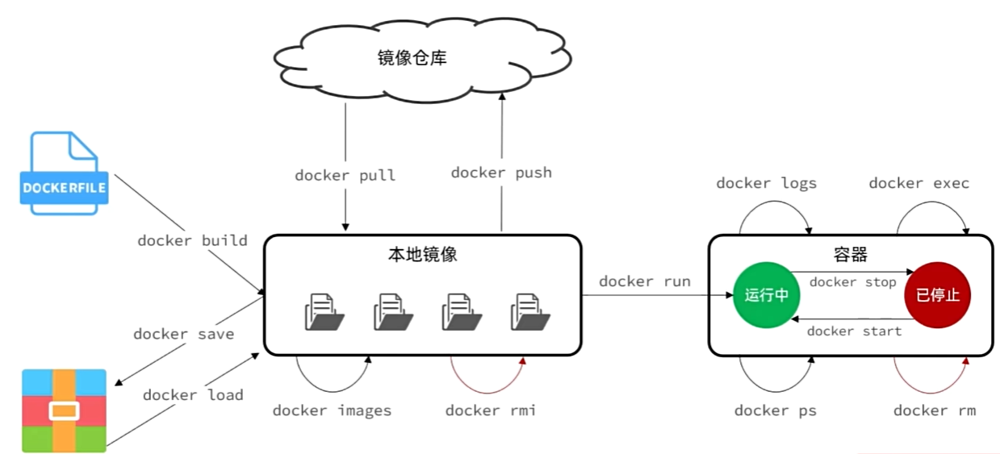

# Docker

## 介绍

Docker 是一个开源的应用容器引擎，让开发者可以打包他们的应用以及依赖包到一个轻量级、可移植的容器中，然后发布到任何流行的 Linux 或 Windows 机器上，也可以实现虚拟化。容器是完全使用沙箱机制，相互之间不会有任何接口（类似 iPhone 的 app）,更重要的是容器性能开销极低。

我们原来安装一个程序，也许需要安装一大堆依赖（还有最恶心的版本问题），安装完之后也需要配置环境变量、重启等等。但是，使用docker的体验完全不同，也许只需要一条命令就可以安装、运行。

**镜像**（image）是一个只读的模板，里面包含了运行一个应用所需的一切：代码、运行时、库、环境变量、配置等。镜像可以被运行、分享、修改，使得开发者可以轻松地在任何地方运行相同的应用，而不用担心环境配置问题。

**容器**（container）是一个运行中的镜像实例，它可以被创建、启动、停止、删除。容器之间共享内核，因此占用资源少，启动速度快。

docker生成的容器自成一番小天地，拥有健全的系统和运行环境，因此直接通过IP去访问是行不通的，因为被隔离在一个容器中。所以，我们需要通过端口映射`外界访问端口:容器内部端口`的方式来访问容器内部的服务。

## 基本命令



这张图来自黑马微服务的课，大概聊聊一些有可能会混淆的命令。

1. `docker build`: 构建镜像，用于创建新的镜像。根据 **Dockerfile** 文件中的指令来创建镜像。
2. `docker run`: 运行**镜像**，用于**启动一个容器**。
3. `docker start/stop`: 用于 启动/关闭 一个**容器**，注意和 `docker run` 的创建并启动是不同的
4. `docker ps`: 列出当前运行的容器。
5. `docker images`: 列出当前系统中所有的镜像。
6. `docker save/load`: 用于保存/加载 镜像，可以将镜像打包以此进行传输。
7. `docker rmi/rmi -f`: 用于删除**镜像**，`-f` 参数用于强制删除。
8. `docker rm/rm -f`: 用于删除**容器**，`-f` 参数用于强制删除。
9. `docker exec`: 用于在**运行中的容器**中执行命令。

### docker run

1. `-d`: 后台运行容器，并返回容器ID。
2. `-it`: 交互式运行容器，进入容器的命令行环境。
3. `-p`: 端口映射，将容器的端口映射到主机的端口。
4. `-v`: 挂载目录，将主机的目录挂载到容器中。
5. `--name`: 为容器指定一个名称。
6. `--rm`: 容器退出后自动删除。
7. `--network`: 指定容器的网络模式。
8. `--env`: 设置环境变量。
9. `--entrypoint`: 指定容器启动命令。

```bash
docker run -d \
  --name mysql \ # 给容器指定一个名称
  -p 3307:3306 \ # 端口映射，这样我们就可以通过访问3307端口来访问容器位于3306端口的mysql服务
  -e TZ=Asia/Shanghai \ # 设置环境变量，设置时区为上海
  -e MYSQL_ROOT_PASSWORD=123 \ # 设置mysql账号密码
  mysql:5.7 # 运行mysql镜像，版本为5.7
```

## 挂载

因为我们使用的容器只包含了最少可以支持运行的程序，所以往往比如我们需要`nano xxx`修改某个文件，我们都会发现nano根本没有被安装，这时候我们就需要使用挂载的方式来将宿主机的目录挂载到容器中。

**挂载**（Mount）：将宿主机的目录挂载到容器中，可以直接操作宿主机上的文件。

### 数据卷挂载

有了这个概念之后，我们就可以通过操作宿主机上的文件来修改容器中的文件了。基本的流程就是先创建volume，然后进行绑定。

1. `docker volume create [volume_name]`: 创建一个数据卷。
2. `docker volume ls`: 列出所有数据卷。
3. `docker volume rm [volume_name]`: 删除一个数据卷。
4. `docker volume inspect [volume_name]`: 查看某个数据卷的详细信息。
5. `docker volume prune`: 清除数据卷。

我们可以通过`-v`参数来挂载到容器中。注意我们必须在`docker run`的时候，也就是容器被创建的时候就直接指定挂载的目录，也就是说对于已经创建好的容器，我们不能再次挂载数据卷。

```bash
docker run -d \
  --name mysql \
  -p 3307:3306 \
  -e TZ=Asia/Shanghai \
  -e MYSQL_ROOT_PASSWORD=123 \
  -v [数据卷名称]:[容器内要挂在到的目录] \ # 挂载数据卷
  mysql:5.7
```

### 本地目录挂载

本地目录挂载适用于不创建数据卷的情况，直接将本地目录挂载到容器中。但要注意的是，本地目录挂载的目录必须是绝对路径，也就是从`/`开始的路径。

```bash
docker run -d \
  --name mysql \
  -p 3307:3306 \
  -e TZ=Asia/Shanghai \
  -e MYSQL_ROOT_PASSWORD=123 \
  -v [本地绝对目录]:[容器内要挂在到的目录] \ # 挂载数据卷
  mysql:5.7
```

## 部署项目

1. `docker build -t [镜像名称]:[版本号] .`: 构建镜像。
2. `docker run -d -p [外网端口]:[容器内端口] --name [容器名称] [镜像名称]:[版本号]`: 运行容器。

### 部署后端项目

假设我们已经有了一个SpringBoot项目，我们可以先打开IDEA，在maven中运行`mvn package`，将项目打包成jar包。接着我们将这个jar包拷贝一份到服务器当中，然后使用`docker build`命令来构建镜像。

```bash
# 构建镜像
docker build -t [镜像名称]:[版本号] .
# 创建并运行容器
docker run -d --name [容器名称] -p [外网端口]:[容器内端口] --network [网络名称] [镜像名称]:[版本号]
# 查看容器日志，确认项目是否启动成功
docker logs -f [容器名称]
```

至此我们如果尝试去访问这个后端项目，就可以实现正常访问了。

### 部署前端项目

我们一般使用nginx来部署前端项目，所以我们需要先将前端项目打包成静态文件。当然，配置nginx.conf文件也是很必要的，使得前端项目可以正确与后端项目通信。在配置conf文件的时候要注意，一定要将后端项目的地址配置为`http://[容器内网地址]:[容器内端口]`或者是`http://[容器名称]:[容器内端口]`。

```bash
docker run -d --name [容器名称] -p [外网端口]:[容器内端口] -v [本地静态文件绝对目录]:[容器内要挂在到的目录] -v [本地nginx.conf文件绝对目录]:[容器内nginx.conf文件目录] --network [与后端项目相同的网络名称] nginx:latest
```

## Docker Compose

Docker Compose 是 Docker 官方编排（Orchestration）工具。它允许用户通过一个单独的 docker-compose.yml 文件定义一组相关联的应用容器为一个服务，帮助实现多个相关联容器的快速部署。

而且这个配置的yaml文件其实格式非常类似于docker run命令的命令行参数，所以我们可以很方便的将docker-compose.yml文件和docker run命令结合起来使用。


