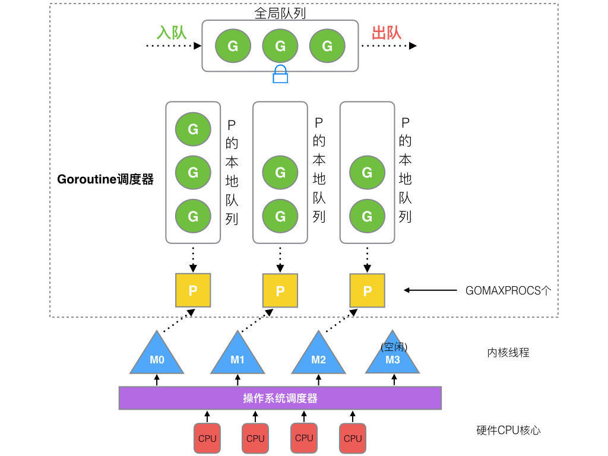

# Go Concurrency Control

Golang 是一门天生从语言层面就极其支持并发的开发语言，而 goroutine 则是 Go 语言并发控制中最重要的一个概念。

## GMP

GMP（Goroutine Machine Processor）基本对标的是 Java 的 JVM，是 Golang 中的线程内存模型。Goroutine 是协程，或者说是用户级的线程，是轻量级的线程。朴素地来说，协程可以跟线程（OS 层面）是一对一的关系，而线程和 CPU 核心在同一时间点也是一对一的。而 GMP 采用的是混合型线程模型，即 $N:M$ 的关系，目的就是为了防止协程阻塞导致线程的阻塞。



G 依赖 M 运行，但为了 G 阻塞带来的可用性问题，需要多对多映射。M 与 P 都是操作系统和硬件层面的，必须是一对一的关系

### 调度策略

1. 用户调用 `go func()` 创建 goroutine（G）
2. 将 P 与 M 通过队列**关联**：调度器将新建的 G 保存到本地队列，若本地队列已满，则将 G 保存到全局队列中，等待调度器调度
3. M 会从本地队列（LRQ）中弹出可执行状态的 G 来执行，若本地为空，M 尝试从全局队列（GRQ）拿一批G放到P的本地队列；若全局队列也未找到可运行的 G 时候，M 会随机从其他 P 的本地队列偷一半放到自己 P 的本地队列
4. 若 M 在执行 G 时发生阻塞（通常由 system call 或其他阻塞操作引起），调度器会调用一个新的 OS 线程去执行这个 G
5. M 执行完毕此 G，获取下一个 G，循环往复...

## Goroutine

goroutine 是一个关键词一个函数，当直接调用是一个普通函数，而在其前添加一个 `go` 关键字（`go func()`的形式），则该函数会以一个 goroutine 的形式运行。并且它并不是一个操作系统层面的线程，而是一个协程，即是用户层面的轻量级线程。

goroutine 跟 C++ 的 thread 类似，main 函数的退出后，其内部的 goroutine 也会一起退出。我们可以通过 sleep 或信道通信的方式来确保 main 函数退出是在goroutine退出之后。

```go
// 一个普通的函数
func() {}

// 启用一个 goroutine
go func() {}

// 启用一个 goroutine 并立刻执行
go func(){}()
```

## Channel

信道，就是一个管道，连接多个goroutine程序，用于 goroutine 间的通信。其中的缓冲区大小可以看作一个队列

```go
// channel 创建
// 实例 = make(chan 数据类型, 缓冲区大小)
ch := make(chan int, 10)
// 往 channel 发送数据
ch <- 1
// 从 channel 接收数据（若ch已关闭则ok为false）
v, ok := <- ch
// 关闭 channel（channel也是资源，需要在使用完毕后及时关闭）
defer close(ch)

cap(ch) // channel 的容量
len(ch) // channel 的长度
<-ch int // 单向只读 channel
ch<- int // 单向只写 channel
```

## WaitGroup

类似于 Semaphore 信号量，也有 C++ 中 `condition variable` 条件变量用于线程通信的影子

```go
// WaitGroup 的创建（初始值为0）
var wg sync.WaitGroup
// 添加 n 个任务
wg.Add(n)
// 任务完成（一次只能完成一个）
defer wg.Done()
// 阻塞（直到值归零）
wg.Wait()
```

## 互斥量

```go
// Mutex 的创建
lock := &sync.Mutex{}
// 加解锁
lock.Lock()
defer lock.Unlock()
// RWMutex 的创建
RWLock := &sync.RWMutex{}
RWLock.RLock() // 加读锁
RWLock.RUnlock() // 释放读锁
RWLock.Lock() // 加写锁
RWLock.Unlock() // 释放写锁
```

## Context 上下文

`Context` 是一种用于传递请求上下文的机制，以 goroutine 为粒度来传递非参数的数据，对标的是 Java 中的 `ThreadLocal`。二者的作用域区别，Threadlocal 可以共享同一线程中多个方法的数据，Context 则是满足 goroutine 及其调用链中的数据传递

```go
type Context interface {
    Deadline() (deadline time.Time, ok bool)    // 确定当前 Context 的生命周期
    Done() <-chan struct{}                      // 返回一个只读的 Channel
    Err() error                                 // 返回 Context 被取消的信息，若没取消则为nil
    Value(key interface{}) interface{}          // 返回 Context 中key对应的值
}
```

Context 的主要作用: 

1. **取消信号传递**： 在 goroutine 之间传递取消信号，当一个 goroutine 需要取消另一个 goroutine 的执行时，可以通过 context 实现。
2. **超时控制**： 设置 goroutine 的执行超时时间，防止 goroutine 长时间阻塞。
3. **请求相关的值传递**： 在 goroutine 之间传递请求相关的值，例如请求 ID、用户身份验证信息等。
