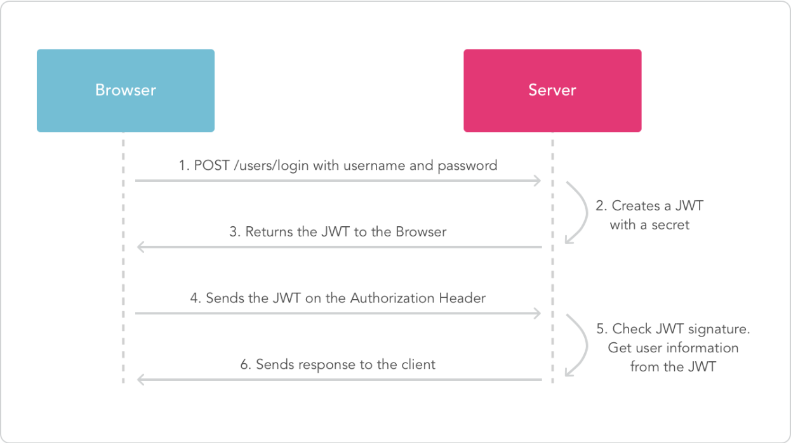

# JWT+Redis实现登录认证

## 为什么采用这个组合实现登录认证

JWT (JSON Web Token) 在 Spring Boot 中非常流行，也是比较推荐的一种登录认证方式。它具有以下优点：  
1. 安全性: JWT 使用签名和加密技术，可以有效地防止数据篡改和伪造。
2. 无状态性: JWT 不需要服务器维护用户的登录状态，简化了服务器端的实现，并提高了可扩展性。
3. 跨平台性: JWT 可以在不同的平台和系统之间传递，方便跨平台应用。

另外在分布式系统当中，对于每个服务器都同时更新token也是不现实的，这样反而加大了服务器的压力。所以我们可以采用 Redis 来存储 JWT，这样每个服务器只需要更新 Redis 中的 token 即可，其他服务器可以从 Redis 中获取到最新有效的 token 进行验证。大概的结构就是`客户端->Redis->多台服务器`。

## 大概流程

使用 JWT 和 Redis 实现登录认证的流程通常如下：  
1. 用户登录: 用户提交用户名和密码，服务器进行验证。
2. 生成 JWT: 如果验证通过，服务器生成一个 JWT，包含用户基本信息、权限等。
3. 存入 Redis: 将生成的 JWT 以及相关信息存储到 Redis 中，例如：
   1. 键: 用户 ID 或用户名。
   2. 值: JWT 以及过期时间。
4. 返回 JWT: 服务器将 JWT 返回给客户端。
5. 客户端使用 JWT: 客户端后续请求时，将 JWT 添加到请求头中。
6. 服务器验证 JWT: 服务器从 Redis 中获取该用户的 JWT，验证其有效性。
7. 授权: 如果 JWT 验证通过且未过期，则允许访问资源，否则拒绝访问。

访问的过程大概如下（图片来自[这篇文章](https://cloud.tencent.com/developer/article/2104689)）



## 代码实现

### 引入依赖

这里只显示本文重点的两个依赖

```xml
   <dependency>
       <groupId>io.jsonwebtoken</groupId>
       <artifactId>jjwt</artifactId>
       <version>0.9.1</version>
   </dependency>
   <dependency>
       <groupId>org.springframework.boot</groupId>
       <artifactId>spring-boot-starter-data-redis</artifactId>
   </dependency>
```

### 配置 Redis

这个也是Redis专栏提到过的，可个性化配置

```yaml
spring:
  redis:
    host: localhost
    port: 6379
    password: 
    database: 0
    timeout: 10000
    lettuce:
      pool:
        max-active: 8
        max-idle: 8
        max-wait: -1ms
        min-idle: 0
```

### 实现登录认证

~~只是举个例子，不保证适用性~~

创建一个JWTUtils工具类，用于生成和验证JWT

```java
@Component
public class JwtUtils {

    @Value("${jwt.secret}")
    private String secret;

    @Value("${jwt.expiration}")
    private Long expiration;

    /**
    * 生成 JWT
    * @param userId 用户 ID
    * @return 生成的 JWT
    */
    public String generateToken(Integer userId) {
        // 设置 JWT 签发时间
        Date nowDate = new Date();
        // 设置 JWT 过期时间
        Date expireDate = new Date(nowDate.getTime() + expiration * 1000);

        // 设置 JWT Payload
        Map<String, Object> claims = new HashMap<>();
        // 添加用户 ID 到 Payload 中
        claims.put("userId", userId);

        // 生成 JWT
        JwtBuilder builder = Jwts.builder()
                .setClaims(claims)
                // 设置签发时间
                .setIssuedAt(nowDate)
                // 设置过期时间
                .setExpiration(expireDate)
                // 设置签名算法
                .signWith(SignatureAlgorithm.HS256, secret);

        return builder.compact();
    }

    /**
    * 解析 JWT
    * @param token JWT
    * @return 解析后的 JWT Claims
    */
    public Claims parseToken(String token) {
        return Jwts.parser()
                .setSigningKey(secret)
                .parseClaimsJws(token)
                .getBody();
    }
}
```

实现登录逻辑，即Controller

```java
@RestController
public class LoginController {

    @Autowired
    private RedisTemplate<String, String> redisTemplate;

    @Autowired
    private JwtUtils jwtUtils;

    @PostMapping("/login")
    public Result login(@RequestBody UserLoginRequest request) {
        // 验证用户名和密码
        // ...

        // 生成 JWT
        String token = jwtUtils.generateToken(userId);

        // 将 JWT 存储到 Redis
        redisTemplate.opsForValue()
            .set(RedisConstants.LOGIN_USER_KEY + token, token, expiration, TimeUnit.SECONDS);

        // 返回 JWT
        return Result.ok(token);
    }
}
```

实现拦截器，防止未登录用户访问受保护资源

```java
@Component
public class JwtInterceptor implements HandlerInterceptor {

    @Autowired
    private JwtUtils jwtUtils;

    @Override
    public boolean preHandle(HttpServletRequest request, HttpServletResponse response, Object handler) throws Exception {
        String token = request.getHeader("Authorization");
        if (token == null || token.isEmpty()) {
            response.setStatus(HttpServletResponse.SC_UNAUTHORIZED);
            return false;
        }

        try {
            jwtUtils.parseToken(token);
            return true;
        } catch (Exception e) {
            response.setStatus(HttpServletResponse.SC_UNAUTHORIZED);
            return false;
        }
    }
}
```
