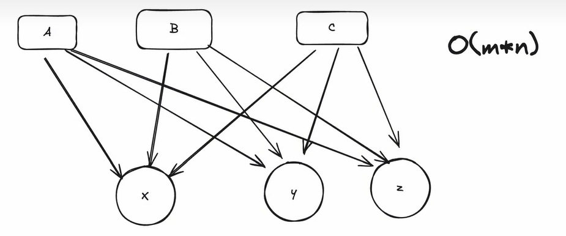
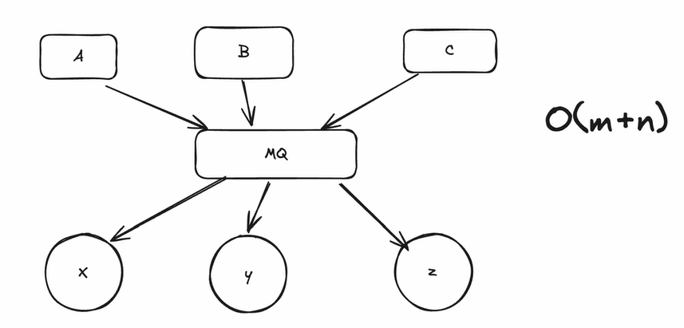

# 消息队列 MQ

消息队列（Message Queue）是一种应用间通信的技术，它是一种异步通信方式，生产者（Producer）将消息放入队列，消费者（Consumer）从队列中获取消息并处理。消息队列的主要作用是解耦，通过消息队列，生产者和消费者之间不需要直接通信，而是通过队列进行通信，生产者将消息放入队列，消费者从队列中获取消息并处理。消息队列的优点是异步通信，削峰填谷，提高系统的处理能力。

其本身的结构最核心的就是一个**生产者-消费者模型**，生产者将消息放入队列，消费者从队列中获取消息并处理。除此之外，消息队列还提供了**消息持久化**、**消息顺序性**、**消息可靠性**、**消息过滤**、**消息路由**等功能来实现高可用和功能性。

## MQ和Kafka的区别

- MQ：消息队列，是一种应用间通信的技术，主要用于解耦。强调的是异步通信。
- Kafka：Kafka是一种分布式的、可扩展的、高吞吐量的消息系统，它可以处理大量的数据，是一种高吞吐量的分布式日志系统。它生来就是为了处理高吞吐量的流式数据。

## 为什么我们需要MQ

### 原先的困境

三个程序A、B、C需要x、y、z三个程序的数据。如果前三者一直盯着后三者的每一个数据，那么时间复杂度很明显是$3 * 3 = 9$的，效率比较低。而且最主要的是，耦合度实在是太高了。

### MQ的优势

* **解耦**：遇到困难我们可以通过加一层中间层来解决，作为一个中间人来分发，下层得到的数据给上层使用。那么我们就只需要接收下层的数据，然后分发给上层使用，也就是$3 + 3 = 6$次。并且这样耦合度低，上下层系统之间是不会有相互感知的，因为这两层没有通信等直接联系。这个中间层就是MQ消息队列。

* **异步**：而且最牛逼的是什么呢，本来下层传输给上层消息和数据这么一个操作，其实需要上层回复确认，表示自己已经收到了，下层才可以继续发送下一条消息，这样就会导致在没有及时回复或者上层出现问题的情况下，下层会一直等待，造成阻塞。但是使用MQ之后，下层只需要把消息放入MQ，上层再从MQ中获取消息，不需要自己回复确认，这样就不会出现阻塞了，也就是异步的通信。

* **可靠性**：MQ可以提供可靠性，因为它可以保证消息不丢失，而且可以支持消息的重复消费。这个离不开生产者和消费者的骨架和其他机制的统筹支持。

## 削峰填谷/流量控制

也就是提供了一个缓冲的作用，使得生产者和消费者之间不会因为消息的堆积或空闲而导致性能下降。

## 点赞处理

之前刷一个视频的时候，我看到评论区在下面讨论到底要不要把点赞消息放到Redis当中。有人说，点赞这种需要反应这么快的，数据库这么慢怎么hold得住；也有人说，点赞量这么大，Redis怎么放得下，而且都2024年了，数据库哪有这么慢这么不堪。

我自己听说啊，一般解决方案都是，首先我们在本地进行点赞数的增加，使得前端渲染出来、显示的点赞数确实看起来增加了，然后我们可以使用消息队列把点赞消息放到MQ中，异步地将点赞信息写入到Redis或是数据库当中，这个由数据量的大小决定。
