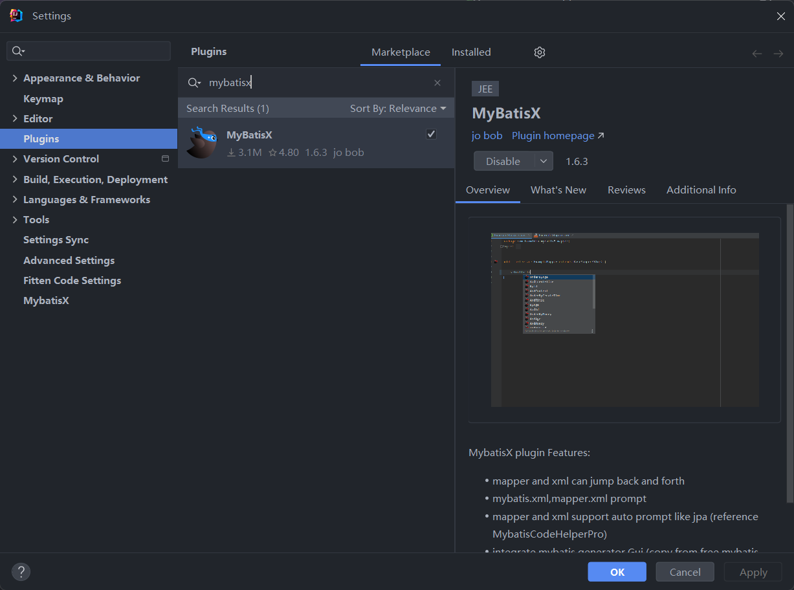
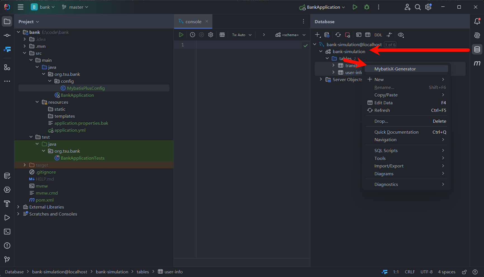
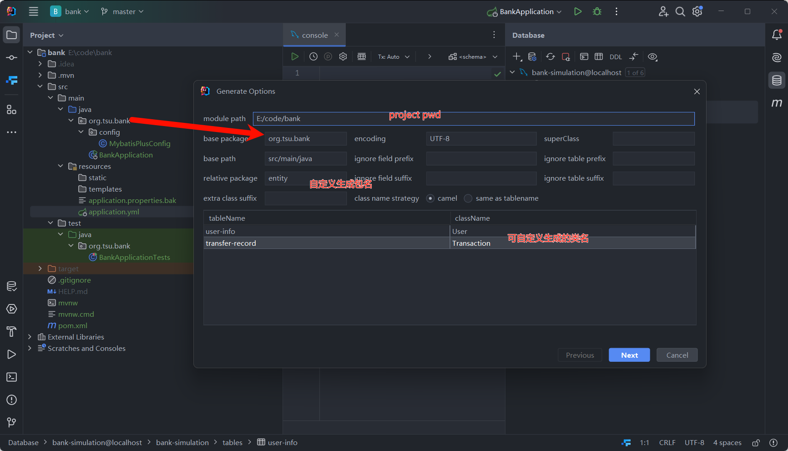
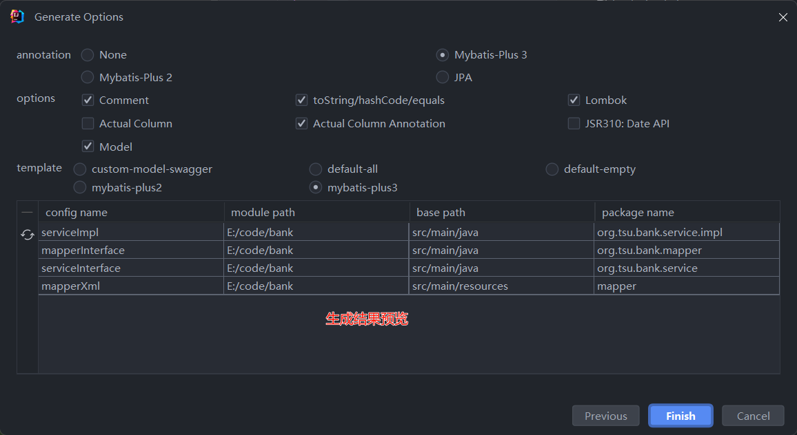

# Mybatis

官方文档: [Mybatis-Plus](https://baomidou.com/introduce/), [Mybatis-Plus-Join](https://yulichang.github.io/mybatis-plus-join-doc/pages/quickstart/js.html)

个人觉得看官方文档大于看那些杂七杂八的视频，真的文档半个小时学会所有语法，看那些什么黑马啊，几个小时你还用不明白。就算忘记了，也可以去文档，就跟小时候查字典一样，哪里不会查哪里，越用越熟的。

先来概述一波，搞java后端说白了就是玩数据库的(并把操控的接口暴露给前端使用)。而为了要能在Spring Boot框架下的Java项目操控DB，就需要JDBC，它使得我们可以在Java代码中直接操作数据库。但是，问题在于JDBC还是很复杂，我们进行了简化就有了基于ORM框架的Mybatis。

你先别急，还有但是，Mybatis其实还是不够简单，为了照顾"低能"的Java程序员，我们连SQL语句都不想打怎么办，就出现了Mybatis Plus，有了它我们甚至只需要用它的封装库，就可以对数据库单表进行CRUD操作。

但是，事情还没完，Java程序员发现，对于多表查询(Join)和分页处理(一个表可能放不下输出)，MP还是需要SQL语句的编写，所以引入了Mybatis Plus Join和Mybatis Plus Extension。它们前者可以进行join操作，后者可以进行分页处理。

但是，这是最后一个但是了。Java程序员一想，SQL语句可以不用写了，我连代码都不想写了，反正Entity和Mapper都是固定的，为什么不能一键生成代码呢？于是MybatisX就出现了，它能根据你数据库的形式，自动生成代码，包括Entity，Mapper，XML。

## 导入依赖

我本地用的是Spring Boot 3.1.6, Java 17。在pom.xml中引入依赖：

### Mybatis-Plus

```xml
        <dependency>
            <groupId>com.baomidou</groupId>
            <artifactId>mybatis-plus-boot-starter</artifactId>
            <version>3.5.7</version>
        </dependency>
```

### Mybatis-Plus-Extension

```xml
        <dependency>
            <groupId>com.baomidou</groupId>
            <artifactId>mybatis-plus-extension</artifactId>
            <version>3.5.7</version>
        </dependency>
```

### Mybatis-Plus-Join

```xml
        <!-- https://mvnrepository.com/artifact/com.github.yulichang/mybatis-plus-join -->
        <dependency>
            <groupId>com.github.yulichang</groupId>
            <artifactId>mybatis-plus-join</artifactId>
            <version>1.4.13</version>
        </dependency>
```

## 安装插件



## 配置文件

1. 配置application.yml以连接到数据库

    ```yaml
    datasource:
        url: spring.application.name=bank-simulation
        driver-class-name: com.mysql.cj.jdbc.Driver
        name: root
        password: 123456
    ```

2. 在根包下创建包config，然后创建MybatisPlusConfig.java。这个很无脑的，只要你用的MySQL基本这样能应对99%的情况，如果不是的话，你换成你用的其他DB也可以的。

    ```java
    @Configuration
    // @MapperScan("org.tsu.banksimulation.mapper")
    public class MybatisPlusConfig {

        @Bean
        public MybatisPlusInterceptor mybatisPlusInterceptor() {
            MybatisPlusInterceptor interceptor = new MybatisPlusInterceptor();
            interceptor.addInnerInterceptor(new PaginationInnerInterceptor(DbType.MYSQL));
            return interceptor;
        }

    }
    ```

3. 右侧栏的Datasource导入就不赘述，之前讲过而且很简单。

## 生成代码

### MyBatisX大显身手







~~效果很惊艳的，我就不放图了~~

### MPJ微调

这些都放心调就行了，因为这些MPJ开头的类都是扩展自Base开头的MP类，所以后者有的，前者不会拉下。

1. 将所有mapper文件做调整，获取MPJ的接口实现(必须)，而且记得加这个注解，不加的话，任何test测试都会报错

```java
@Mapper
public interface UserMapper extends MPJBaseMapper<User> {
}
```

2. 将所有service文件做调整，获取MPJ的接口实现(可选)

```java
public interface UserService extends MPJBaseService<User> {
    // 添加接口
}
```

3. 将所有serviceImpl文件做调整，获取MPJ的接口实现(可选)

```java
@Service
public class UserServiceImpl extends MPJBaseServiceImpl<UserMapper, User>
    implements UserService{
    // 添加实现
}
```

## 总结

再提一点我的个人体验，MP和MybatisX是我平时一直用的，但是这俩仅限于单表CRUD操作，对于多表查询和分页处理，还是需要SQL语句的编写。而MPJ我感觉其实并不好用，不如你直接去`Mapper`里面直接用SQL语句实现，其实写个SQL并没有很难，况且Join类的多表操作其实并不多，它的效率问题就注定了频率不可能很高。但是MPJ你装了肯定无伤大雅的，它是对MP的扩展，MP有的它都有的，万一用到了对吧，而且它的封装更好听更规范。

`Wrapper`这个概念在MP里面也算是重点了，我的经验是抛弃所有普通Wrapper，只用`LambdaWrapper`，不论你是单纯查询还是更新。二者区别就是，前者来做判断是用字段名称的String形式区分，后者调用实体类的方法来区分，前者你可能记错，后者不可能对错。

而在MPJ里面，只有`MPJLambdaWrapper`和`MPJQueryWrapper`。这里老样子我还是建议使用前者，不同点在于后者是要写SQL语句的，前者可以用`Class::GetMethod`的办法，因为你都用这些插件了，还用SQL不是脱裤子放屁吗。