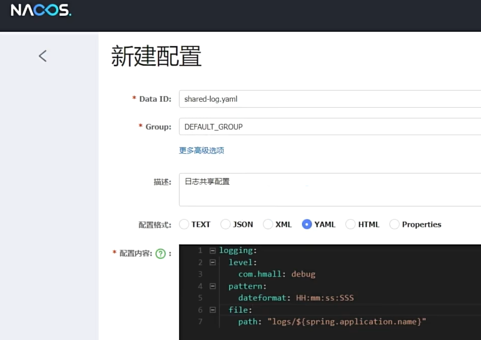

# Nacos

2018年，阿里巴巴开源了Nacos，它是一款开源的注册中心和配置中心。它提供了包括服务注册和发现，服务配置管理，动态 DNS，服务及其元数据管理，流量管理，API 网关管理，服务监控等功能。

## SpringBoot集成Nacos

1. 添加依赖

```xml
<dependency>
    <groupId>com.alibaba.cloud</groupId>
    <artifactId>spring-cloud-starter-alibaba-nacos-discovery</artifactId>
</dependency>
```

2. 配置Nacos

```yaml
spring:
  application:
    name: demo
  cloud:
    nacos:
        server-addr: 127.0.0.1:8848
```

3. 服务发现

动态获取服务提供者的地址，从而发起调用

```java
@RestController
@RequestMapping("/api")
public class DemoController {

    @Autowired
    private DiscoveryClient discoveryClient;

    @GetMapping("/hello")
    public Result hello() {
        // 通过服务名获取服务提供者的地址
        List<ServiceInstance> instances = discoveryClient.getInstances("demo-provider");
        if (instances == null || instances.size() == 0) {
            return Result.fail(500, "No provider available");
        }
        // 负载均衡，挑选一个服务提供者
        ServiceInstance instance = instances.get(RandomUtils.randomInt(0, instances.size()));
        // 获取服务提供者的地址
        URL url = instance.getUri();
        return Result.success("Hello, " + instance.getServiceId() + " from " + instance.getHost() + ":" + instance.getPort());
    }
}
```

### OpenFeign集成Nacos

我们观察可以发现服务发现这个流程很复杂，所以在SpringCloud生态中，一般都会使用OpenFeign来简化服务发现的流程。OpenFeign是一个声明式的HTTP客户端，它使得编写Web服务客户端变得更简单，它默认被集成到Spring Cloud中，可以直接使用。

1. 添加依赖

```xml
<!-- OpenFeign -->
<dependency>
    <groupId>org.springframework.cloud</groupId>
    <artifactId>spring-cloud-starter-openfeign</artifactId>
</dependency>
<!-- 如果需要使用负载均衡，需要添加 -->
<dependency>
    <groupId>org.springframework.cloud</groupId>
    <artifactId>spring-cloud-starter-loadbalancer</artifactId>
</dependency>
```

2. 启用OpenFeign

我们可以直接通过`@EnableFeignClients`注解开启OpenFeign的功能。

```java
@EnableFeignClients
@SpringBootApplication
public class DemoApplication {
    public static void main(String[] args) {
        SpringApplication.run(DemoApplication.class, args);
    }
}
```

3. 使用`@FeignClient`实现远程调用

通过使用这个注解，我们就不需要具体实现这个接口，OpenFeign之后会动态代理帮我们实现。最后的效果跟调用比如 MP 实现的`userService`是一样的，就只需要一行代码进行查询，以及`demoClient`的一行接口声明就可以。

```java
@FeignClient(name = "demo-provider")
public interface DemoFeignClient {

    @GetMapping("/hello")
    Result hello() {
        List<ServiceInstance> instances = demoClient.queryByName("demo-provider");
    }
}
```

## 服务中心

我们在微服务当中，有服务提供者和服务调用者两个角色，服务调用者需要调用服务提供者的接口，而且每个服务其实都有可能扮演这二者之一的角色。

那么比如在一个集群模式下，有5个服务调用者关注着10个服务提供者的接口。那么每个服务调用者都需要知道每个服务提供者的地址，并且关注服务提供者的变化，这种乘算显然有非常大的资源消耗的。

注册中心的作用就是解决这个问题，它是服务调用者和提供者的中间者，提供者可以来注册自己，当调用者需要调用某个服务时，它可以从注册中心获取到服务提供者的地址，然后直接调用即可。

这样更容易我们去合理地选择分配服务调用者和提供者，并且可以做到服务调用者和提供者的动态绑定，当服务提供者出现故障时，调用者可以自动切换到另一个服务提供者。比如我们可以采用负载均衡的方式，将请求均匀地分配到多个服务提供者上，而不至于服务提供者旱的旱死，涝的涝死。

### 心跳检测

既然调用者已经可以从注册中心获取到服务提供者的地址，并且可以负载均衡。但当服务提供者出现故障时，注册中心需要知道，这样调用者才会切换到另一个服务提供者。所以注册中心需要周期性地向服务提供者发送心跳，告诉它自己还活着。

当服务提供者超过一定时间没有发送心跳，注册中心就认为它已经挂了，这个挂掉的服务提供者就需要从注册中心中移除，这时调用者就需要切换到另一个服务提供者。

### 服务注册与发现

Nacos支持服务的注册与发现，服务提供者向Nacos注册自己的服务，并提供服务的元数据，包括IP地址，端口号，服务名，集群名，权重等。

服务消费者通过Nacos查询服务提供者的地址，并通过负载均衡算法选择一个服务提供者。

## 配置管理

由于在微服务项目中，多个子模块下的的application.yml配置文件，大部分情况下都存在着相同的内容，或者说配置内容只需要修改某个名称。这种冗余可以采用配置管理的方式解决，提取出公共配置，再到各个子模块中引用、填写差异化的配置。

我们不需要在SpringCloud项目中编写代码，而是在Nacos中配置数据，然后通过Nacos的配置管理功能，动态获取配置。

比如我们要提取出JDBC的配置，我们可以先提取出公共的配置yaml文件，再到Nacos当中`配置管理->配置列表->新建配置`，设置DataID为`shared-jdbc.yaml`，描述随意，配置格式为YAML，将公共的配置yaml文件上传到Nacos并放到配置内容。那么对于swagger的、日志的配置也都是同理。



对于差异化内容，我们采用经典的`${}`形式来进行变量替换。比如对于上面这个图片的替换，我们就可以这样写。而且在填写完这个之后，图片中配置内容中的配置都会自动生效。

    ```yaml
    spring:
        application:
            name: demo
    ```

搞定之后点击发布，它就已经注册成功了，我们可以回到SpringCloud项目中，对每个服务的application.yml文件进行编写配置。

### 拉取共享配置

nacos注册生效还需要我们在模块中引入配置信息，存放在`bootstrap.yml`中。

    ```yaml
    spring:
        application:
            name: demo
        profiles:
            active: dev # 生效哪个环境的配置
        cloud:
            nacos:
                server-addr: 127.0.0.1:8848
                config:
                    file-extension: yaml
                    shared-configs:
                        - data-id: shared-jdbc.yaml
                          group: DEFAULT_GROUP
                          refresh: true
    ```

## 总结

### 服务治理中的三个角色及其职责

1. 服务提供者：暴露服务接口，提供服务，向注册中心注册自己，并周期性地发送心跳。
2. 服务消费者：调用服务接口，向注册中心订阅自己所需的服务，并从注册中心获取服务提供者的地址。
3. 注册中心：存储服务提供者的地址，并提供服务调用者查询服务提供者地址的功能。记录并监控各项服务的状态，推送更新服务变更信息。

### 消费者和提供者通讯

服务提供者在启动时向注册中心注册自己，并周期性地发送心跳。消费者在启动时向注册中心订阅自己所需的服务，并从注册中心获取服务提供者的地址。

### 消费者如何得知服务状态的变更

服务提供者通过心跳机制向注册中心发送心跳以报告自己的健康状态。当心跳异常时，注册中心会将该服务提供者从服务列表中移除，消费者会收到服务变更通知，并重新获取新的服务提供者的地址。

### 如何在多个提供者中选择

一般会采用负载均衡的方式，将请求均匀地分配到多个服务提供者上。

1. 轮询：每个消费者按顺序轮询服务列表，直到找到可用的服务提供者。
2. 随机：每个消费者随机选择一个服务提供者。
3. 权重：每个服务提供者都可以设置权重，权重越高，被选中的概率越高。
4. 一致性Hash：将服务列表映射到一个Hash环上，消费者根据服务的名称计算Hash值，然后顺时针找到最近的服务提供者。
