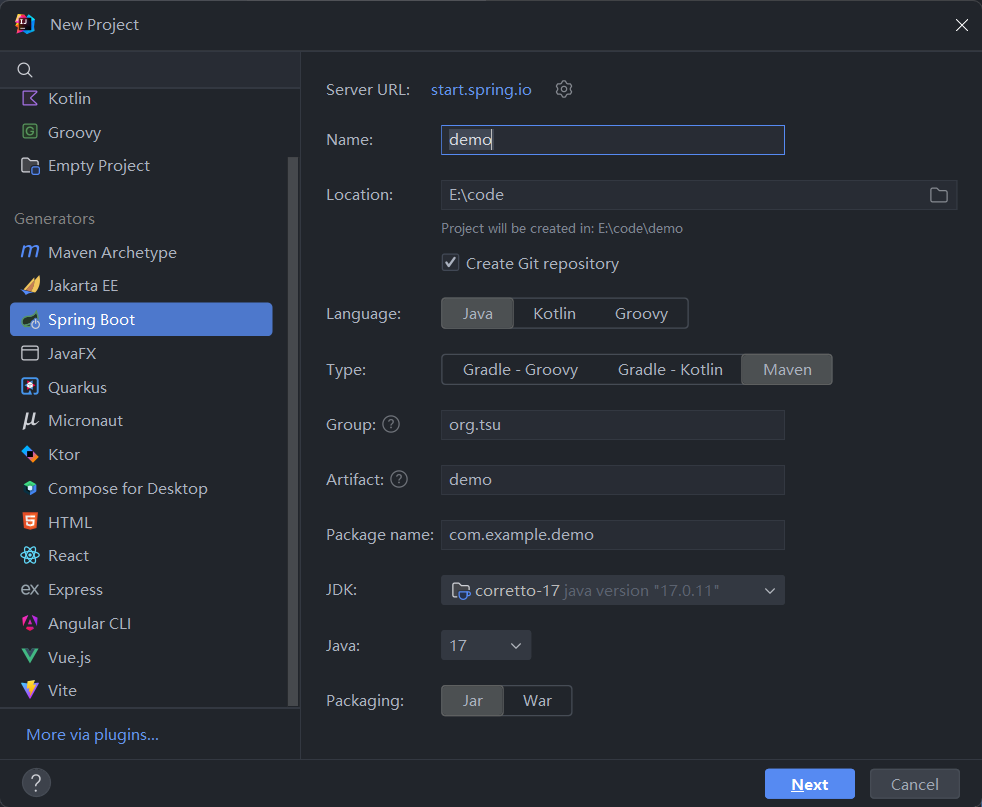
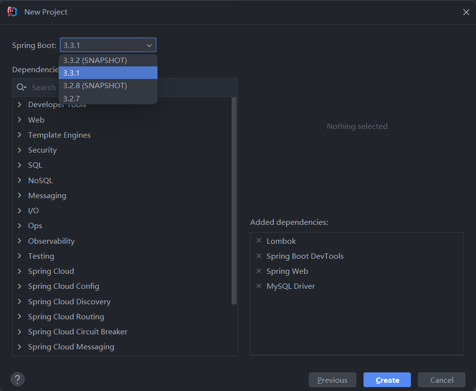
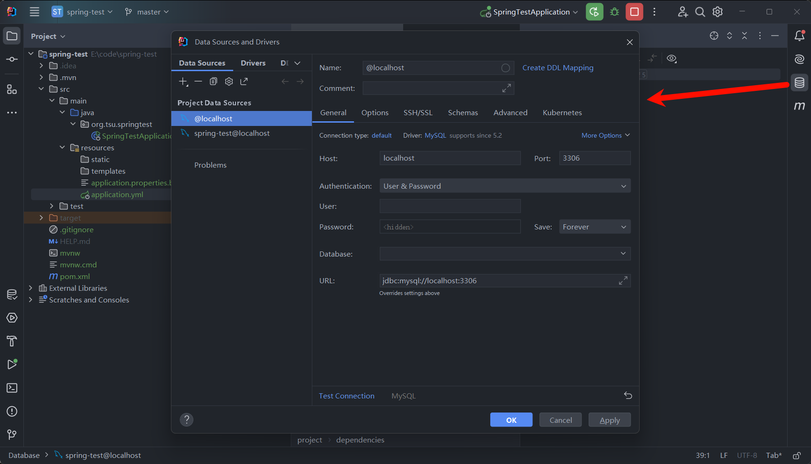
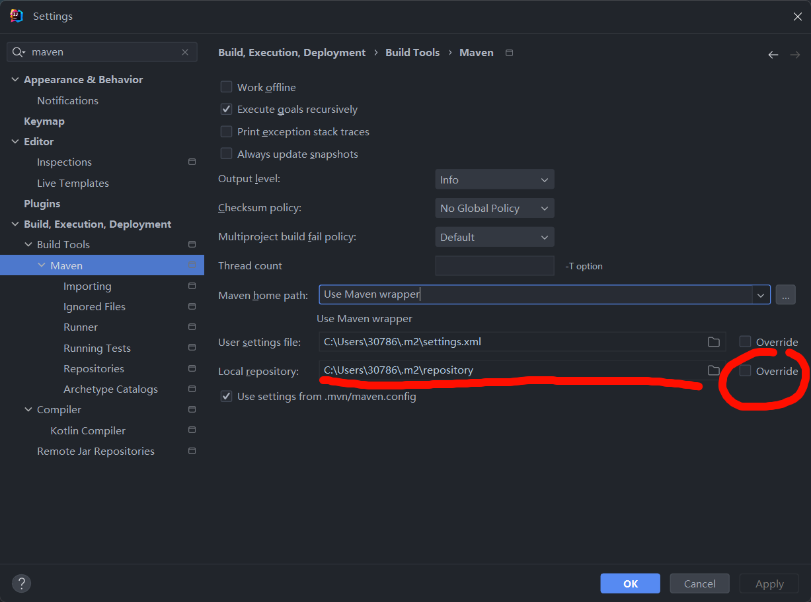
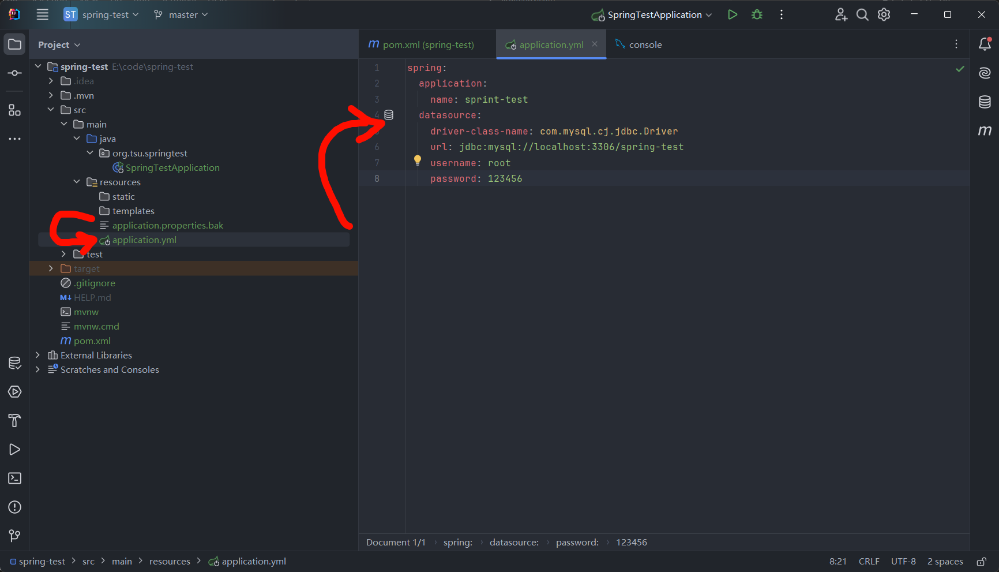
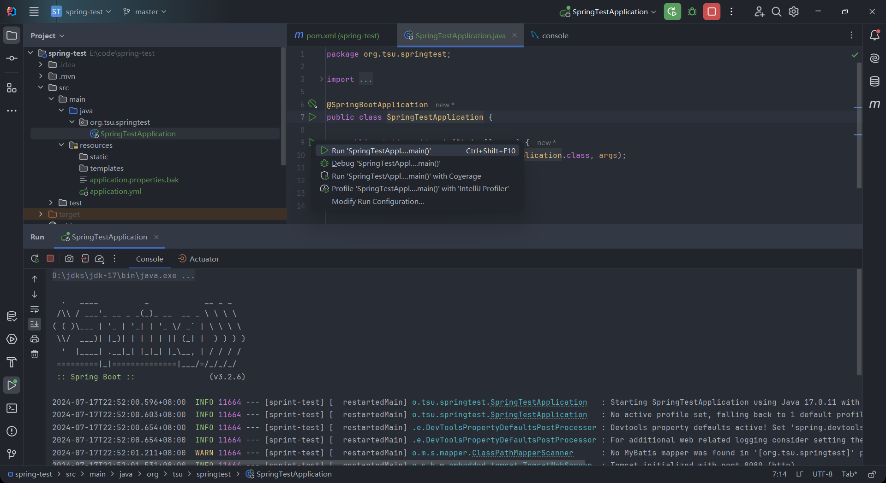

## Spring Boot 3 项目创建

这个真的踩了好多坑，跟着网上教程好久一步步来都能报错

1. maven源设置

这个可搞可不搞，不能科学上网的话，搞一个下载速度提示还是比较显著的。

这个在maven安装目录下的setting.xml文件中设置，在<mirrors>标签下添加如下代码：

```xml
<mirror>
    <id>aliyunmaven</id>
    <mirrorOf>*</mirrorOf>
    <name>阿里云公共仓库</name>
    <url>https://maven.aliyun.com/repository/public</url>
</mirror>
```

2. 项目创建

这个`start.spring.io`源不建议换，project name随你，jdk版本也随便，按照它的来



3. 依赖选择

这里就算你要改spring boot的版本，你别急待会可以改的。基本常用的依赖就这几个，`mybatis-plus`的依赖进去了再加。



4. 导入MySQL数据库



5. 修改spring boot版本

`pom.xml`文件中修改版本号

比如我创建的时候是3.3多，现在随便改

这个需要注意，springboot应该是更新的快，然后mybatis-plus是来不及更新，所以遇到类似这样的报错，你可以尝试把spring boot的版本降低。
```
java.lang.IllegalArgumentException: Invalid value type for attribute 'factoryBeanObjectType': java.lang.String
```

```xml
	<parent>
		<groupId>org.springframework.boot</groupId>
		<artifactId>spring-boot-starter-parent</artifactId>
		<version>3.2.6</version>
		<relativePath/> <!-- lookup parent from repository -->
	</parent>

```

附上修改maven依赖的下载位置，如何改变~~防止C盘爆红~~



1. 添加`mybatis-plus`依赖

添加到`pom.xml`文件中，改完记得刷新maven

注意这个版本号千万不能错，`mybaits-plus`的3.5.7版本对应`spring-boot`的3.2.6版本，如果你用的版本不一样，记得改。这个你可以去GitHub上查查。

```xml
		<dependency>
			<groupId>com.baomidou</groupId>
			<artifactId>mybatis-plus-boot-starter</artifactId>
			<version>3.5.7</version>
		</dependency>

```

7. 修改`application.properties`文件

这里我不确定跟步骤`4`是否重复，但是我只做`4`好像会报错。

首先，修改为yml文件，因为这个可读性什么的都比properties好。然后添加数据库源的设置。



8. 测试运行

到这里就成功啦，去浏览器访问`http://localhost:8080/`试试吧。

这里还有一个Warning是因为还没有具体设置。


