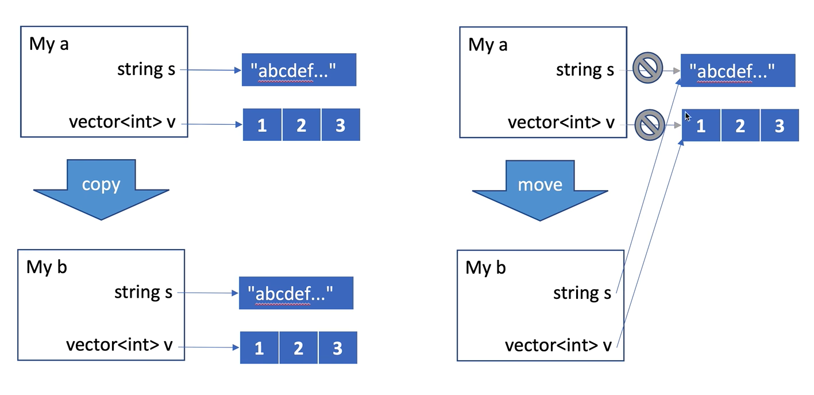

# std::move

## 左值和右值
  
  1. 左值: 赋值表达式结束后仍然存在的持久对象
  2. 右值: 赋值表达式用完即丢的临时对象
   
```cpp
    int n;
    n = 1; // 这里n是左值，1是右值，n在赋值完还会继续存在，但是1就会消失
    1 = n; // 这里就是一个错误的语法，值从右传递到左，1在分配后就会被移除
```

## std::move

> 划重点: std::move就是一个右值引用

### move的原理

比如说我这里有一个class My，它的组成是这样的
```cpp
class My {
    std::string s;
    std::vector<int> v;
}
```

如果我分配了两个My类的instance分别为a和b，当我进行 `b = std::move(a)` 操作时候，实际的情况如下图所示

我尽量把图片出处都搞清楚。  
这张来自B站UP[happyyang的百草园](https://space.bilibili.com/312883756)，很有实力的老哥。


这个图可以说是一目了然了。move直接让b指向了a的内容，同时也将a的内容全都如同右值那样直接舍弃和移除。  

* 外显的效果就是将a中的所有内容都迁移到了b当中  

* 这不同于普通的copy，在copy完之后a还是有内容的，b只是保留得到了一个a的副本。

**但是**，需要提一点的是，在`std::move`当中还有一些特性...  
比如Small String Optimization(短字符串优化)，它会在你实际move之前先判断你要move的string长不长。如果长，那么我们就跟上面讲的一样，进行这种迁移，a本身的内容不会存在了；但如果这个string很短，我们就会直接对其进行拷贝。  
(再扯一点，这也是为什么短字符串在stack中，而长字符串在heap上)

### move的优点
  
  最后来聊聊move有什么让我们不得不去用它的理由  

   1. 减少不必要的数据复制，使得性能开销一定程度的减小，从而达到提高性能的作用
   
~~emmm可能我就只能列出这一项吧~~

## emplace

这个之前就想讲的，当然它肯定是得跟`push`一起讲

来看一个场景

```cpp
struct human {
  int age;
  string name;
}

int main() {
  // 现在有一个城市，刚出生了两个婴儿a和b
  vector<human> city;
  city.push_back(human(1, "a"));
  city.emplace_back(1, "b");
}
```

这里可以发现`push`进去的参数得是`vector`中的元素类型，而`emplace`的参数却只需要`vector`中元素构造所需要的参数。

* 简单来说，`push`进行了拷贝，先显式构造一个元素，再将其拷贝到了这里的`city`当中，其内部的机理类似于这样(伪代码)

```cpp
// constuct first
human a = human(1, "a");
// add this a's copy to city
city += a.copy();
```

* 而对于`emplace`来说，它自动会在`city`内部进行构造，相当于进行了一次`move`的右值引用

```cpp
city += std::move(human(1, "b"));
```

## 深浅拷贝

* 浅拷贝：  
只拷贝指针地址，C++默认拷贝构造函数与赋值运算符重载都是浅拷贝；

  节省空间，但容易引发多次释放；

<br>

* 深拷贝：
重新分配堆內存，拷贝指针指向内容。
浪费空间，但不会导致多次释放；

<br>

* 怎么兼有二者的优点？
方案一：引用计数；
方案二：C++新标准的移动语义；
move 资源让渡