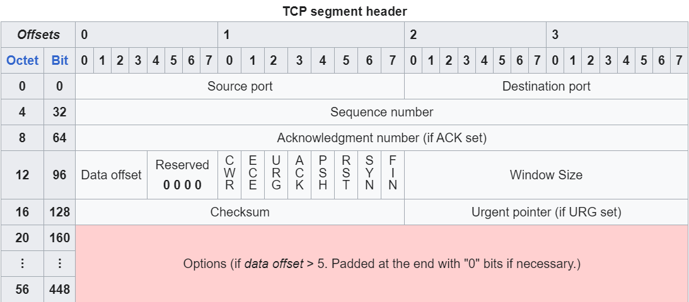
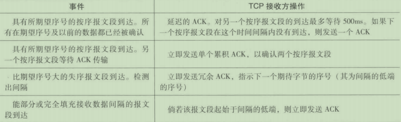

# TCP 协议

~~这篇不会讲三次握手四次挥手，实在太简单讲烂了的东西~~

对于本文，图源自Wikipedia，内容参照Top-Down一书

RTT: Round-Trip Time，往返时间，也就是从发送数据包到接收到确认包所花费的时间。

RTO: Retransmission TimeOut，重传超时，也就是当TCP发送数据包后，如果没有收到确认包，则会等待一段时间，如果在这段时间内，没有收到确认包，则会重新发送数据包。

MSS: Maximum Segment Size，最大报文段长度，也就是TCP报文的最大长度。

窗口大小: 窗口大小是指在一个TCP连接中，可以同时发送的数据包的数量。

## TCP 头部格式

1. 源端口号 (Source Port)
2. 目的端口号 (Destination Port)
3. 序号 (Sequence Number)
4. 确认号 (Acknowledgement Number)
5. 数据偏移 (Data Offset)
6. 保留 (Reserved)
7. TCP 标志 (TCP Flags)
   1. CWR (Congestion Window Reduced)
   2. ECE (ECN-Echo)
   3.  URG (Urgent Pointer)
   4.  ACK (Acknowledgment Number)
   5.  PSH (Push)
   6.  RST (Reset Connection)
   7.  SYN (Synchronize Sequence Numbers)
   8.  FIN (Finish)
8.  窗口大小 (Window Size)
9.  校验和 (Checksum)
10. 紧急 (Urgent)

## 滑动窗口 (Sliding Window)

这个具体可以看[Selective Repeat sliding Window Protocol by Khurram Tanvir](https://www.youtube.com/watch?v=Cs8tR8A9jm8)

大概意思就是，TCP每次发送数据，一般都不是一个一个发送，等到收到对方的确认后，才发送下一个数据包。实际上，采用了**滑动窗口**的方式，比如窗口大小为5，那么TCP就会一次性发出5个包出去。

比如发出去的是1-5这五个包，那么当收到1的确认之后，窗口向前滑动一格，现在的滑动窗口是2-6了，那么我们需要把窗口内的包全部发送完毕，也就是要把6也给发出去。

但是，如果我们此时收到了3，4，5，6的确认，未读没有收到窗口的最前面一个包2，那么我们则无法进行滑动，只能等到收到2的确认后，才能继续发送。

### 回退N步

原名Go-Back-N，简写GBN。

对于2-6的大小为N=5的滑动窗口，如果接收的不是2，那么每个之后的确认包都会被丢弃，在重传的时候，需要把整个滑动窗口N大小的包全部重传一遍

### 选择重传

原名Selective Repeat，简写SR。

对于2-6的大小为N=5的滑动窗口，如果接收的不是2，每个之后的确认包也都会被接收，在重传的时候，只需要重传丢失的包即可。

## 流量控制 (Flow Control)

### 超时重传 (Timeout Retransmission)

还是老一个例子，对于2-6的大小为N=5的滑动窗口，在2被发送之后就会启动一个定时器，如果到超时时间还没有收到确认包，基本可以被认为是丢包了，那么就重传2，如果收到了确认包，那么就重置定时器。

### 快速重传 (Fast Retransmit)

超时触发重传存在的问题之一是超时周期可能相对较长。当一个报文段丢失时，这种长超时周期迫使发送方延迟重传丢失的分组，因而增加了端到端时延。幸运的是，发送方通常可在超时事件发生之前通过注意所谓余ACK来较好地检测到丢包情况。冗余ACK（duplicateACK）就是再次确认某个报文段的ACK，而发送方先前已经收到对该报文段的确认。

## 拥塞控制 (Congestion Control)

拥塞控制是流量控制的子集，同时有这几个重要概念

1. rwnd: receiver window，接收窗口，也就是接收方的缓冲区大小。
2. cwnd: congestion window，拥塞窗口，也就是发送方的缓冲区大小。
3. MSS: maximum segment size，最大报文段长度。
4. ssthresh: slow start threshold，慢启动阈值，也就是当拥塞窗口cwnd达到ssthresh时，进入拥塞避免阶段。

### 慢启动 (Slow Start)

TCP连接的最开始，cwnd的大小一般比较小，值为MSS，也就是最大报文段长度。

如果正确收到了ACK，那么cwnd就会乘2。比如第二次就是2个MSS，第三次就是4个MSS，以此类推。

### 加性增，乘性减 (Additive Increase, Multiplicative Decrease)

当cwnd达到ssthresh时，进入拥塞避免阶段。cwnd每收到一个ACK，就会增加一个MSS，这样做的目的是为了避免网络拥塞。比如之前8个MSS，本来在慢启动阶段是变成16个MSS的，但是在拥塞避免阶段，只是9个MSS。

当接收到3个冗余ACK时，意味着网络拥塞，cwnd会进行减半操作，也就是乘性减。比如本来是16个MSS，现在变成8个MSS。

由此可见，**ssthresh**其实是个之前留下的经验值，用来大概判断大概在怎么样的cwnd会使得网络产生轻微的拥塞。而三次冗余ACK则表明出现了丢包，直接证明了网络拥塞已经正式发生。

### 拥塞避免 (Congestion Avoidance)

当出现三次冗余ACK证明网络确实已经产生一点的堵塞了，所以我们需要避免网络的进一步拥塞，同时也要保证我们能传送信息。

我们将cwnd重置为1个MSS，ssthresh设置为重置前cwnd的一半。

### 快速恢复 (Fast Recovery)

在拥塞避免之后，我们会进入快速恢复阶段。

我们又重新开始乘增cwnd，直到再次到达对折减半的ssthresh，再次开始线性增长(即每次加一)，直到再次出现三次冗余ACK，开始循环。

当然当网络状况转好的时候，ssthresh的大小也会增大的。

### 网络堵死

当网络状况持续恶化，而我们在多次超时重传之后，又没有收到任何的ACK，那么我们就认为网络已经出现了严重的拥塞，那么我们就不应该再传任何东西了。因为网络已经真正堵死了，我们不应该再传进去任何信息，使得网络拥塞更加严重。

在这种情况下，我们需要重置部分的网络状态。
