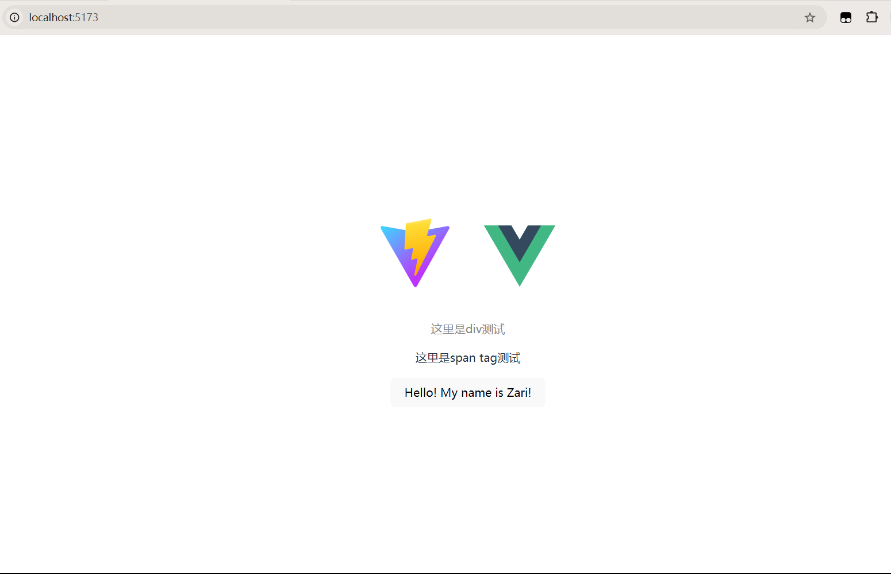
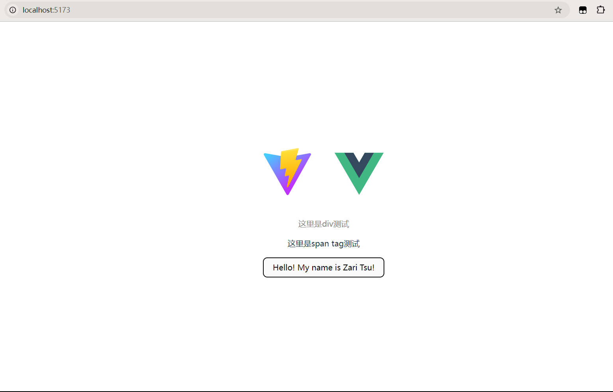

# Vue 入门

先来聊聊**Vue** ([vjuː]) 这玩意怎么读，其实跟View是同一个发音，我之前还听到有人读yue的，没错就是那个呕吐的那个yue了，闹笑话了。

现在全栈是一个有竞争力的点，并且在StackOverflow的统计当中，国外的全栈工程师的占比其实是最高的，因此在我们大概掌握了后端的使用后，我们需要了解一下前端。

那么前端什么语言好呢？最古老有名的肯定是HTML, CSS这几个。但是前两个其实都有点无法跟上时代了(可能这么说有失偏颇)，所以我们使用Vue来开发前端应用是一个比较好的选择。它相较于这三者，有以下优点：

1. 学习曲线低：Vue 的学习曲线相对较低，因为它是一套渐进式的JavaScript框架，只需要掌握一些基础语法，就可以上手使用。
2. 易上手：Vue 简单易学，上手速度快，因为它提供了丰富的组件，可以快速实现功能。
3. 性能高：Vue 相比于其他框架，它的性能要好很多，因为它采用了虚拟 DOM 技术，可以有效地减少 DOM 操作，提高渲染性能。
4. 社区活跃：Vue 是一个活跃的社区，它有丰富的插件、工具、教程，可以帮助开发者解决问题。

## 安装配置项目

### 安装 Node.js

   首先需要安装 Node.js，因为 Vue 是一个基于 Node.js 的框架，所以需要先安装 Node.js。这个具体怎么安装不说了，教程太多，使用`node -v`判断是否安装配置成功。除了普通安装加手动配置环境变量的方法，windows环境下使用`scoop`, `chocolatey`等包管理器安装node.js也是个不错的选择。

### 使用 npm 创建项目

    随便开个文件夹，然后在命令行里输入命令

    ```shell
    $ npm create vite@latest

    > npx
    > create-vite

    √ Project name: ... vite-project   # 项目名称, 随便起个名字
    √ Select a framework: » Vue
    √ Select a variant: » JavaScript

    Scaffolding project in E:\code\vuetest\vite-project...

    Done. Now run:

    cd vite-project
    npm install
    npm run dev
    ```

    关于这里为什么用vite而不是Vue，是因为vite是Vue的官方脚手架，可以快速搭建Vue项目。

### 安装依赖

项目创建完毕后，就可以运行它给我们的上面三行代码啦

细心的朋友如果这时候去ls查看一下目录可以发现`package.json`这个文件，这个其实就是配置的主力文件，类似于SpringBoot里面的`pom.xml`文件，我们执行安装的时候看的就是它。

```shell
$ ls
d-----         .vscode
d-----         public
d-----         src
-a----         .gitignore
-a----         index.html
-a----         package.json
-a----         README.md
-a----         vite.config.js
```

然后我们执行`npm install`或者简写成`npm i`安装依赖。

### 运行项目

安装完需要的依赖之后，我们就可以直接用IDE打开项目了，这里可以用VsCode，也可以用IntelliJ，看自己喜好。

打开`package.json`，我们可以看到有个`scripts`字段，里面有三个选项，分别是`dev`, `build`, `preview`。它们分别是热启动的，编译打包，预览的命令。

运行`npm run dev`就可以访问指定端口的页面了。

运行`npm run build`的打包，则是会在项目根目录下生成一个`/dist`的文件夹，用来存放编译后的代码。

我们去`/src`文件夹下看看，发现有两个子文件夹，分别是`assets`和`components`，`assets`用来存放静态资源，`components`用来存放Vue组件。

```shell
$ tree src
└─src
    ├─assets
    └─components
        └─HelloWorld.vue
```

那么其实我们在打开端口网页内容就是这个HelloWorld.vue组件的内容，我们可以修改它，然后热更新就能看到效果。

## Vue 的使用

### 基本语法

扯一下里面的那些`<> </>`符号，其实就是HTML的标签，我们可以用Vue组件来替换掉这些标签，这样就能更加方便地开发。

`<template>`: 模板。这个是用来定义Vue组件的模板的，里面可以写HTML代码。

`<p>`: 这个是用来定义一个段落的，可以用`{{ }}`来绑定数据。

`<script>`: 脚本。这个是用来定义Vue组件的逻辑的，里面可以写JavaScript代码。

`<style>`: 样式。这个是用来定义Vue组件的样式的，里面可以写CSS代码。

`<span>`: 这个是用来定义一个文本的，可以用`{{ }}`来绑定数据。双大括号的形式就类似于`${}`这种使用变量的玩法。

`<button>`: 这个是用来定义一个按钮的，可以用`@click`来绑定事件。

`<div>`: 这个是用来定义一个容器的，可以用`class`和`style`属性来定义样式。

`<input>`: 这个是用来定义一个输入框的，可以用`v-model`来绑定数据。

`<ul>`: 这个是用来定义一个无序列表的，可以用`v-for`来遍历数据。

`<li>`: 这个是用来定义一个列表项的，可以用`{{ }}`来绑定数据。

`<router-view>`: 这个是用来定义路由视图的，可以用`router-link`来定义路由。

`<router-link>`: 这个是用来定义路由链接的，可以用`to`属性来定义路由。

`<transition>`: 这个是用来定义过渡动画的，可以用`name`属性来定义动画效果。

`<transition-group>`: 这个是用来定义动画组的，可以用`name`属性来定义动画效果。

`<keep-alive>`: 这个是用来缓存组件的，可以用`include`和`exclude`属性来定义缓存范围。

`<slot>`: 这个是用来定义插槽的，可以用`slot`属性来定义插槽名称。

所以初始化的HelloWorld.vue可以被这样理解

```vue
<script>
// 一些配置的内容，大概可以理解为C++里面`#include #define`和变量的命名
</script>

<template>
  <!--这里是主体部分，写在这里可以改变网页的显示-->
</template>

<style scoped>
// 用来显示样式
.read-the-docs {
  color: #888;
}
</style>

```

### 基本编写

```vue
<script>
export default {
  // data是用来存储组件的状态的
  data() {
    // 这里返回一个对象，包含了组件的状态，其实就是命名一个变量
    return {
      // 这里用键值对的形式进行存储，注意键不能跟数据库一样加引号，不然会变成静态字符串
      name: "Zari",
      message: "Hello"
    }
  },
  // methods是用来定义组件的方法的
  methods: {
    // 这里定义了组件的方法，可以用this调用，从而改变组件的状态
    sayHello() {
      this.name = "Zari Tsu";
    }
  }
}
</script>

<template>
  <div class="read-the-docs">
    <p>这里是div测试</p>
  </div>
  <span>
    <p>这里是span tag测试</p>
  </span>
  <!--这个@click用来绑定一个方法，当按钮被点击时，调用sayHello方法-->
  <button @click="sayHello">
    {{ message }}! My name is {{ name }}!
  </button>
</template>
```

这时候页面显示是这样的



当我们尝试点击按钮，就会触发sayHello方法，改变name的值，页面显示就会发生变化。因为这个method我改变了我的名字从`Zari`变成了`Zari Tsu`，页面所以相对应变成了这样。



### 和后端交互

在后端我们一般会使用RESTful API，最解决前端的一层就是`Controller`，我们可以用`axios`来进行与后端的交互。

你可以听说过很多`ajax`这种东西，其实就是前端与后端交互的一种方式，但是`axios`更加方便，而且可以用Promise来处理异步，并且后者其实是已经封装了前者。

我们可以用`npm i axios`来安装`axios`依赖。

安装完依赖，我们就可以开始配置了。我们在`src`目录下创建文件`utils/request/request.js`。我们可以通过下面这个例子的代码和注释来了解大概如何使用`axios`来进行后端的交互。

```js
// 先导入包，然后使用 axios.xxx 调用方法
import axios from 'axios';

// 创建 axios 实例
const service = axios.create({
    baseURL: 'http://127.0.0.1:8080', // api base_url
    timeout: 5000 // 请求超时时间
});

// 请求拦截器
service.interceptors.request.use(
    config => {
        // 在发送请求之前做一些处理
        // 这个就是咱们在后端通过Authorization拿到的token
        config.headers['Authorization'] = 'Bearer ' + token;
        // 这个就是我们在比如使用PostMan测试接口的时候，需要设置的请求头，用json还是plain-text
        config.headers['Content-Type'] = 'application/json;charset=UTF-8';
        return config;
    },
    error => {
        // 处理请求错误
        return Promise.reject(error);
    }
);

// 响应拦截器
service.interceptors.response.use(
    response => {
        // 处理响应数据，相当于一个全局的拦截器，如果返回200异常码，则进行拦截处理
        const res = response.data;
        if (res.code !== 200) {
            return Promise.reject(new Error(res.message || 'Error'));
        } else {
            return res;
        }
    },
    error => {
        return Promise.reject(error);
    }
);

// 给外界暴露一个 request 方法
export const request = (url, method, data = '') => {
    return service({
        url: url,
        method: method,
        // 因为get方法要把查询请求参数放在url里面，如果是其他的话就需要放在一个对象里(具体什么对象由content-type决定)
        // 也就是说，params是路径传参，而data是请求体传参
        [method === 'get' ? 'params' : 'data']: data,
    })
}

// 封装常用接口，举个例子而已
export const getRequest = (url, params = {}) => request(url, 'get', params);

export const postRequest = (url, data = {}) => request(url, 'post', data);
```

### 从前端获取数据

我们回到`HelloWorld.vue`组件，我们可以用`axios`来获取后端的数据。其他的暂且不变，我们需要写一个方法来装载这个request方法的返回值。

```vue
<script>
import { request } from '../utils/request/request.js';

export default {
  data() {
    return {
      name: "Zari",
      message: "Hello",
    }
  },
  methods: {
    getHelloMessage() {
        // 用var类型的变量来装载request方法的返回值，当然因为我们这里的response其实不会变化所以换用const
        // 注意这里的url可以忽略IP和端口的前缀
        const response = request('/api/hello', 'get', 'data');
        // 我们可以用这个在页面审查时查看返回的数据
        console.log(response);
    },
    // 除此之外，我们还可以异步地获取数据，比如用async/await
    async getHelloMessageAsync() {
        try {
            const response = await request('/api/hello', 'get', 'data');
            console.log(response);
        } catch (error) {
            console.log(error);
        }
    }
}
</script>
```

### 解决跨域问题

**跨域这部分我还不确定，因为各种情况引人而异，这部分是ai自动生成的**

1. 后端设置允许跨域

我们需要在后端设置允许跨域，比如在`springboot`项目中，我们可以用`@CrossOrigin`注解来设置。

2. 前端设置允许跨域

我们需要在前端设置允许跨域，比如在`vue`项目中，我们可以用`axios`的`withCredentials`属性来设置。

```js
// 创建 axios 实例
const service = axios.create({
    baseURL: 'http://127.0.0.1:8080', // api base_url
    timeout: 5000, // 请求超时时间
    withCredentials: true // 允许携带cookie
});
```

这样就可以跨域了。

## 生命周期

生命周期是Vue组件的一个重要概念，它可以帮助我们在不同的阶段进行一些操作，比如mounted、updated、destroyed等。

### create

我们可以在组件的`created`阶段进行一些**初始化操作**，就是一开始就在你执行任何操作之前就做完了，比如请求数据、初始化变量等。**注意`created`只是加载数据获取数据，并不会对数据进行渲染。**

### mounted

我们可以在组件的`mounted`阶段进行一些**渲染操作**，就是当组件被挂载到页面上之后，我们可以进行一些渲染操作，比如渲染数据、渲染页面等。

### unmounted

我们可以在组件的`unmounted`阶段进行一些**销毁操作**，就是当组件被销毁的时候，我们可以进行一些销毁操作，比如清除定时器、取消请求等。这个不经常用无所谓了。

```js
export default {
  data() {
    return {
      name: "Zari",
      message: "Hello",
    }
  },
  // created代表数据获取完毕，但是dom还没生成无法操作
  created() {
    // 这里可以请求数据
    this.getHelloMessage();
  },
  // mounted代表dom生成完毕，可以操作dom，类似对span标签的操作
  mounted() {
    // 这里可以渲染数据
    console.log('mounted');
  },
  methods: {
    getHelloMessage() {
        const response = request('/api/hello', 'get', 'data');
        console.log(response);
    }
  }
}
